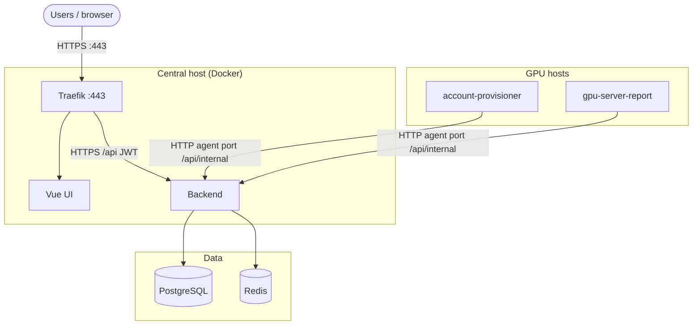

# GSAD — GPU Server Access Dashboard

**Languages:** [English](README.md) · [简体中文](README.zh-CN.md)

Self-hosted dashboard for GPU SSH access: users apply, agents provision accounts, and reporters send metrics.

**Stack:** Spring Boot 4 / Java 21 · Vue 3 + Vite · PostgreSQL 16 · Redis 7 · Traefik v3

| I want to… | Start here |
| ---------- | ---------- |
| Deploy production | [Deploy](#deploy) |
| Try locally (no TLS) | [docs/local-prod.md](docs/local-prod.md) |
| Develop UI + mock agents | [docs/dev.md](docs/dev.md) |
| Onboard students (spreadsheet) | [Account preparation](#account-preparation-spreadsheet--gsad--netbird) |

*Operators → [Deploy](#deploy). Developers → [docs/dev.md](docs/dev.md).*

## Contents

- [GSAD — GPU Server Access Dashboard](#gsad--gpu-server-access-dashboard)
  - [Contents](#contents)
  - [Prerequisites](#prerequisites)
  - [Deploy](#deploy)
  - [Agent access \& security](#agent-access--security)
  - [After deploy](#after-deploy)
    - [First admin](#first-admin)
    - [Account preparation (spreadsheet → GSAD + NetBird)](#account-preparation-spreadsheet--gsad--netbird)
    - [Agent PSK (per GPU host)](#agent-psk-per-gpu-host)
    - [Backup and restore](#backup-and-restore)
    - [Upgrades and health](#upgrades-and-health)
  - [Repository layout](#repository-layout)
  - [Configuration](#configuration)
  - [Other setups](#other-setups)
  - [Tests](#tests)
  - [Further reading](#further-reading)



> [!NOTE]
> Agents call `/api/internal/*` over HTTP on `BACKEND_AGENT_PORT` (private/VPN IP). Traefik blocks these routes on `:443`. See [Agent access & security](#agent-access--security).

## Prerequisites

- Docker and Docker Compose

## Deploy

1. Clone with submodules:

```bash
git clone --recursive git@github.com:zeroDtree/server-manager.git
# or, after a plain clone:
# git submodule update --init --recursive
```

2. Configure and start — edit `GSAD_PUBLIC_HOST` and `ACME_EMAIL` in `.env` before `secret.sh`:

```bash
cp .env.example .env
# set GSAD_PUBLIC_HOST and ACME_EMAIL in .env
./utils/secret.sh
docker compose -f compose.yaml -f dockers/compose.prod.yaml --profile prod up -d --build
```

3. Point DNS for `GSAD_PUBLIC_HOST` at this host; open ports 80 and 443. Traefik terminates HTTPS (Let's Encrypt).
4. Wait for backend health:

```bash
curl -sS "https://${GSAD_PUBLIC_HOST}/actuator/health"
# expect: {"status":"UP",...}
```

5. [Create the first admin](#first-admin).
6. **Admin → Import servers** (CSV); [derive agent PSKs](docs/agent-psk.md); deploy [server-agent](server-agent/) on each GPU host.
7. **Admin → Import users**.
8. Restrict `BACKEND_AGENT_PORT` (default `:8080`) to GPU hosts / VPN CIDR only — never expose it on the public internet.
9. Enable [backups](docs/backup.md); test a restore periodically.

## Agent access & security

**Two entry paths**

| Path            | Audience                  | Protocol | Routes                                                 |
| --------------- | ------------------------- | -------- | ------------------------------------------------------ |
| Users / browser | HTTPS `:443` via Traefik  | HTTPS    | `/`, `/api/*` (JWT)                                    |
| GPU agents      | Host `BACKEND_AGENT_PORT` | HTTP     | `/api/internal/*` (`X-Agent-Server-Id`, `X-Agent-PSK`) |

**Why HTTP, not the public HTTPS URL?**

- Traefik blocks `/api/internal/*` on `:443` (by design).
- Agents use the central host's private/VPN IP (e.g. NetBird), not `https://${GSAD_PUBLIC_HOST}`.
- Avoids per-host TLS cert management; auth is per-server HMAC derived from `AGENT_MASTER_SECRET`.

**Network requirements**

- Restrict `BACKEND_AGENT_PORT` (default `:8080`) to GPU hosts only — NetBird mesh CIDR, private LAN, or firewall allowlist.
- Set `BACKEND_AGENT_BIND` to `127.0.0.1` or an RFC1918 address; startup rejects `0.0.0.0` and public IPs.

> [!WARNING]
> Do not expose `:8080` to the public internet. HTTP carries agent credentials in cleartext.

> [!IMPORTANT]
> Use a long random `AGENT_MASTER_SECRET` on the **backend only**; the backend rejects the default value. Per GPU host, derive `AGENT_PSK` — see [Agent PSK (per GPU host)](docs/agent-psk.md). Never put `AGENT_MASTER_SECRET` on GPU hosts.

**Agent config:** `REPORT_API_URL=http://<central-netbird-or-private-ip>:8080` — see [server-agent/README.md](server-agent/README.md).

## After deploy

### First admin

Flyway is schema-only; there is **no seeded admin**. After `backend` and `postgres` are healthy, create the first admin with [`create-prod-admin.sh`](utils/create-prod-admin.sh).

From the repo root:

```bash
ADMIN_EMAIL=admin@example.com ./utils/create-prod-admin.sh
```

Or set the password inline (do **not** store bootstrap passwords in `.env`):

```bash
ADMIN_EMAIL=admin@example.com ADMIN_PASSWORD='your-strong-password' ./utils/create-prod-admin.sh
```

The script is **idempotent**: if an admin already exists, it exits without changes. For a clean bootstrap after dev/mock, run [`down -v`](docs/local-prod.md#reset-clean-db) on the [local HTTP stack](docs/local-prod.md), then `up` and this script again.

Optional env: `ADMIN_LINUX_USERNAME` (default `gsadadmin`), `ADMIN_DISPLAY_NAME` (default `Admin`).

Verify login:

```bash
curl -sS -X POST "https://${GSAD_PUBLIC_HOST}/api/auth/login" \
  -H 'Content-Type: application/json' \
  -d '{"email":"admin@example.com","password":"<your-password>"}'
```

On the [local HTTP stack](docs/local-prod.md), use `http://localhost/api/auth/login` instead.

Change the bootstrap password via **Account → Change password** in the sidebar (or `POST /api/auth/change-password`).

Import users via **Admin → Import users**. Required columns: `email`, `linux_username`, `initial_password` (min 8 chars). Optional: `display_name`, `student_id`, `cohort`, `roles`. Distribute initial passwords out-of-band — they are never returned in the API response. Admins can reset a user's login password from **Admin → Users** (non-admin accounts only).

### Account preparation (spreadsheet → GSAD + NetBird)

Bulk onboarding from a registration spreadsheet is handled by [`account_prepare/`](account_prepare/): SQLite ledger, import CSVs under `data/account_prepare/`, NetBird/GSAD reconcile, and unified credential email. See [docs/info.md](docs/info.md) for what to collect from students and [account_prepare/README.md](account_prepare/README.md) for the full workflow (`prepare-accounts` → NetBird import → GSAD UI import → `reconcile-accounts` → `notify-accounts`).

### Agent PSK (per GPU host)

Each GPU agent uses a per-server HMAC derived from the backend-only `AGENT_MASTER_SECRET`. Derive `AGENT_PSK` on a trusted machine and deploy to agents — see [docs/agent-psk.md](docs/agent-psk.md).

### Backup and restore

Scheduled Postgres backups, log rotation, and restore — see [docs/backup.md](docs/backup.md).

### Upgrades and health

- Backend health: `/actuator/health`
- Agent health: `:9091` (provisioner), `:9092` (reporter)

```bash
curl -sS "https://${GSAD_PUBLIC_HOST}/actuator/health"
# expect: {"status":"UP",...}
```

Upgrade central stack:

```bash
git pull && git submodule update --init --recursive && \
  docker compose -f compose.yaml -f dockers/compose.prod.yaml --profile prod up -d --build
```

Upgrade agents on GPU hosts: `git pull && sudo ./deploy/install.sh`.

Pre-flight: use the [local HTTP stack](docs/local-prod.md) to validate images and routing before real DNS and TLS.

## Repository layout

Git submodules — run `git submodule update --init --recursive` after clone.

| Path                                | Role                                                                                                          |
| ----------------------------------- | ------------------------------------------------------------------------------------------------------------- |
| [gsad-backend](gsad-backend/)       | REST API, Flyway, internal agent routes                                                                       |
| [gsad-frontend](gsad-frontend/)     | Vue UI                                                                                                        |
| [server-agent](server-agent/)       | account-provisioner + gpu-server-report (systemd on GPU hosts)                                                |
| [netbird-manage](netbird-manage/)   | NetBird CLI (`user-manage`, `policy-manage`) — submodule                                                      |
| [account_prepare](account_prepare/) | Registration spreadsheet → GSAD/NetBird CSVs and credential email                                             |
| [dockers](dockers/)                 | Compose files, Dockerfiles, and dev mock agents (`dockers/mocks/`)                                            |
| [utils](utils/)                     | Repo-level ops scripts (`.env` secret bootstrap, first admin, agent PSK derivation, DB backup, systemd units) |

## Configuration

Deploy requires `GSAD_PUBLIC_HOST` and `ACME_EMAIL` in `.env`. Run [`secret.sh`](utils/secret.sh) to generate random secrets (≥32 chars) for the rest. Keys you have already set are not overwritten. Full comments in [`.env.example`](.env.example).

| Variable                         | Required | Default        | Notes                                                              |
| -------------------------------- | -------- | -------------- | ------------------------------------------------------------------ |
| `SPRING_PROFILES_ACTIVE`         | yes      | `dev`          | `prod` with `compose.prod.yaml`                                    |
| `GSAD_PUBLIC_HOST`               | yes      | —              | Traefik hostname and DNS                                           |
| `ACME_EMAIL`                     | yes      | —              | Let's Encrypt email                                                |
| `BACKEND_AGENT_PORT`             | no       | `8080`         | Host port for agent internal API                                   |
| `BACKEND_AGENT_BIND`             | no       | `127.0.0.1`    | Loopback or RFC1918; see [Agent access & security](#agent-access--security) |
| `CREDENTIALS_ENCRYPTION_KEY`     | yes      | —              | AES key for SSH credentials at rest (≥32 chars)                    |
| `AGENT_MASTER_SECRET`            | yes      | —              | Backend-only; derive PSK via [docs/agent-psk.md](docs/agent-psk.md) |
| `JWT_SECRET`                     | yes      | —              | JWT signing key (≥32 chars)                                        |
| `DB_PASSWORD` / `REDIS_PASSWORD` | yes      | —              | Data store passwords                                               |
| `CORS_ALLOWED_ORIGINS`           | no       | empty          | Usually empty when UI and API share host via Traefik               |

> [!WARNING]
> Do not use placeholder values from `.env.example`. Run [`secret.sh`](utils/secret.sh) or set strong random values manually. Swagger is disabled in production; agent auth uses derived PSK + `X-Agent-Server-Id` over HTTP on the private port.

## Other setups

| Setup                            | Guide                                    |
| -------------------------------- | ---------------------------------------- |
| Development (Vite + mock agents) | [docs/dev.md](docs/dev.md)               |
| Local stack without TLS          | [docs/local-prod.md](docs/local-prod.md) |

## Tests

```bash
cd gsad-backend && ./mvnw test
cd gsad-frontend && npm run lint && npm run typecheck && npm test
```

License: [LICENSE](LICENSE)

## Further reading

- [docs/agent-psk.md](docs/agent-psk.md) — per-GPU host PSK derivation
- [docs/backup.md](docs/backup.md) — backup, restore, and log rotation
- [account_prepare/README.md](account_prepare/README.md) — spreadsheet onboarding workflow
- [gsad-backend/README.md](gsad-backend/README.md) — API routes, schema, Flyway
- [server-agent/README.md](server-agent/README.md) — GPU host agent install
- [gsad-frontend/openapi/openapi.json](gsad-frontend/openapi/openapi.json) — OpenAPI spec (checked in)
