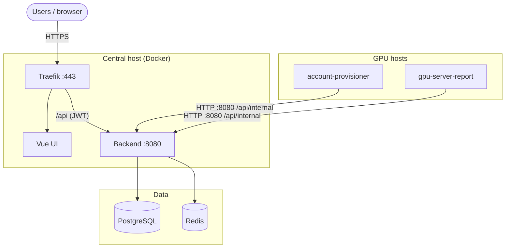

# GSAD — GPU Server Access Dashboard

GPU server access management: users apply for SSH access; agents on GPU hosts provision accounts and report metrics. Stack: Spring Boot 4 / Java 21, Vue 3 + Vite, PostgreSQL 16, Redis 7, Traefik v3.



**Production** — two entry paths: users reach the UI and public `/api` over HTTPS via Traefik (`:443`); GPU agents call `/api/internal/*` on plain HTTP at `BACKEND_AGENT_PORT` on the host's private/VPN IP (Traefik blocks those routes on `:443`). See [Agent access & security](#agent-access--security).

**Development** — Vite on `:5173` proxies `/api` to the backend on `:8080`; optional mock agents run in Docker. See [docs/dev.md](docs/dev.md).

## Prerequisites

- Docker and Docker Compose
- Node.js (frontend dev only)

## Quick start

- Set `GSAD_PUBLIC_HOST` and `ACME_EMAIL` for prod
- DNS for `GSAD_PUBLIC_HOST` must point at this host; open ports 80 and 443


```bash
git clone --recursive git@github.com:zeroDtree/server-manager.git
# or, after a plain clone: 
# git submodule update --init --recursive

cp .env.example .env
./utils/secret.sh
docker compose -f compose.yaml -f dockers/compose.prod.yaml --profile prod up -d --build
```

Traefik terminates HTTPS (Let's Encrypt). Agent access uses a separate HTTP port — details below.

### Agent access & security

**Two entry paths**

| Path            | Audience                         | Protocol            | Routes                                                 |
| --------------- | -------------------------------- | ------------------- | ------------------------------------------------------ |
| Users / browser | HTTPS `:443` via Traefik         | `/`, `/api/*` (JWT) |
| GPU agents      | Direct host `BACKEND_AGENT_PORT` | HTTP                | `/api/internal/*` (`X-Agent-Server-Id`, `X-Agent-PSK`) |

**Why HTTP, not the public HTTPS URL?**

- Traefik blocks `/api/internal/*` on `:443` (by design).
- Agents use the central host's private/VPN IP (e.g. NetBird), not `https://${GSAD_PUBLIC_HOST}`.
- Avoids per-host TLS cert management; auth is per-server HMAC derived from `AGENT_MASTER_SECRET`.

**Network requirements (required in prod)**

- Restrict `BACKEND_AGENT_PORT` (default `:8080`) to GPU hosts only — NetBird mesh CIDR, private LAN, or firewall allowlist.
- Set `BACKEND_AGENT_BIND` to `127.0.0.1` or an RFC1918 address (prod rejects `0.0.0.0` and public IPs).
- Do not expose `:8080` to the public internet (HTTP carries agent credentials in cleartext).
- Use a long random `AGENT_MASTER_SECRET` on the **backend only**; prod startup rejects the default value.
- Per GPU host: derive `AGENT_PSK` — see [Agent PSK (per GPU host)](#agent-psk-per-gpu-host). **Never** put `AGENT_MASTER_SECRET` on GPU hosts.

**Agent config:** `REPORT_API_URL=http://<central-netbird-or-private-ip>:8080` — see [server-agent/README.md](server-agent/README.md).

## Getting started

| Mode            | Guide                                    |
| --------------- | ---------------------------------------- |
| Development     | [docs/dev.md](docs/dev.md)               |
| Local prod-like | [docs/local-prod.md](docs/local-prod.md) |

## Production operations

Ongoing prod setup and ops after the stack is running (prod or prod-local).

### First admin (prod bootstrap)

Prod Flyway is schema-only; register GPU servers via **Admin → 服务器导入** (CSV). There is **no seeded admin** in prod — create the first admin with [`create-prod-admin.sh`](utils/create-prod-admin.sh) after the stack is healthy.

After `backend` and `postgres` are healthy, from the repo root:

```bash
ADMIN_EMAIL=admin@example.com ./utils/create-prod-admin.sh
```

Or set the password inline (do **not** store bootstrap passwords in `.env`):

```bash
ADMIN_EMAIL=admin@example.com ADMIN_PASSWORD='your-strong-password' ./utils/create-prod-admin.sh
```

The script is **idempotent**: if an admin already exists, it exits without changes. For a clean prod-local bootstrap after dev/mock, run [`down -v`](docs/local-prod.md#reset-clean-db) first, then `up` and this script again.

Optional env: `ADMIN_LINUX_USERNAME` (default `gsadadmin`), `ADMIN_DISPLAY_NAME` (default `Admin`).

Verify login (prod-local):

```bash
curl -sS -X POST "http://localhost/api/auth/login" \
  -H 'Content-Type: application/json' \
  -d '{"email":"admin@example.com","password":"<your-password>"}'
```

Verify login (real prod over HTTPS):

```bash
curl -sS -X POST "https://${GSAD_PUBLIC_HOST}/api/auth/login" \
  -H 'Content-Type: application/json' \
  -d '{"email":"admin@example.com","password":"<your-password>"}'
```

Then import users via **Admin → Import CSV**. Required columns: `email`, `linux_username`, `initial_password` (min 8 chars). Optional: `display_name`, `student_id`, `cohort`, `roles`. Distribute initial passwords out-of-band — they are never returned in the API response. Admins can reset a user's login password from **Admin → Users** (non-admin accounts only).

### Account preparation (spreadsheet → GSAD + NetBird)

Bulk onboarding from a registration spreadsheet (email, linux username, name, student id, cohort) is handled by [`account_prepare/`](account_prepare/). It maintains a SQLite registration ledger (stable passwords), writes import CSVs under `data/account_prepare/`, reconciles status from NetBird and GSAD, and emails unified credentials. See [docs/info.md](docs/info.md) for what to collect from students.

```bash
cd account_prepare && uv sync
uv run --project account_prepare prepare-accounts
uv run --project netbird-manage user-manage import \
  -f data/account_prepare/netbird_import_delta.csv --resolve-group-names
# GSAD: Admin → 用户导入 ← data/account_prepare/gsad_users_delta.csv
uv run --project account_prepare reconcile-accounts
uv run --project account_prepare notify-accounts --send
```

Set `GSAD_PUBLIC_URL`, `NETBIRD_TOKEN` (for reconcile), and `SMTP_*` in repo-root `.env`. See [account_prepare/README.md](account_prepare/README.md).

### Agent PSK (per GPU host)

Each GPU agent authenticates with a per-server HMAC derived from the backend-only `AGENT_MASTER_SECRET`. Run [`derive-agent-psk.sh`](utils/derive-agent-psk.sh) on a trusted machine with a TTY (your laptop or the central host — **not** on GPU agents). The script prompts for the master secret twice; it is never read from env or argv.

From the repo root, after you know `AGENT_SERVER_ID` for that host:

```bash
./utils/derive-agent-psk.sh <AGENT_SERVER_ID>
```

Capture stdout for agent config (prints only the derived hex):

```bash
AGENT_PSK=$(./utils/derive-agent-psk.sh gpu-node-01)
```

**Batch (many hosts):** put `server_id` in a CSV (optional extra columns preserved), prompt once for the master secret, get `agent_psk` per row:

```bash
./utils/derive-agent-psk-batch.sh servers.csv -o agents-with-psk.csv
chmod 600 agents-with-psk.csv
```

Stdout-only (redirect yourself): `./utils/derive-agent-psk-batch.sh servers.csv > agents-with-psk.csv`. Output contains secrets — do not commit.

Upload the same CSV via **Admin → 服务器导入** (`server_id` required; `agent_psk` column is ignored). Use `agent_psk` when deploying agents.

Paste the hex into the agent's `AGENT_PSK` in [`server-agent/deploy/env/common.env`](server-agent/deploy/env/common.env). **Never** deploy `AGENT_MASTER_SECRET` to GPU hosts.

Set `REPORT_API_URL=http://<central-netbird-or-private-ip>:8080` on each agent — see [Agent access & security](#agent-access--security) and [server-agent/README.md](server-agent/README.md).

### Backup schedule

DB backup script: [`utils/backup-postgres.sh`](utils/backup-postgres.sh). Defaults: 30-day retention, 500 MB total cap under `<repo>/backups/`. Override with `BACKUP_DIR`, `RETENTION_DAYS`, `MAX_TOTAL_MB`.

Container logs are rotated at 10 MB × 3 files per service (see [`dockers/compose.yaml`](dockers/compose.yaml)). DB backups are capped as above.

**systemd timer** (recommended): installs units with `@REPO_ROOT@` resolved to this clone; output goes to journald:

```bash
sudo ./utils/install-backup-timer.sh
```

Check status: `systemctl status gsad-backup-postgres.timer` · View logs: `journalctl -t gsad-backup`

**Cron** (alternative; daily at 03:00; use your clone path):

```cron
0 3 * * * cd /opt/server-manager && ./utils/backup-postgres.sh 2>&1 | logger -t gsad-backup
```

After changing compose logging options, recreate containers so limits apply:

```bash
docker compose --profile prod up -d --force-recreate
docker inspect gsad-backend-1 --format '{{.HostConfig.LogConfig}}'
# expect: map[max-file:3 max-size:10m]
```

**Restore** (maintenance window — stop backend or pause writes first):

```bash
gunzip -c backups/gsad_YYYYMMDD_HHMMSS.sql.gz | docker compose exec -T postgres psql -U gsad gsad
```

### Production checklist & best practices

1. Run [`secret.sh`](utils/secret.sh) after copying `.env.example` (fills random secrets ≥32 chars; skips keys already set).
2. Point DNS for `GSAD_PUBLIC_HOST` at the host; open ports 80 and 443.
3. Restrict `BACKEND_AGENT_PORT` (default `:8080`) to GPU hosts / VPN CIDR only — never expose it on the public internet.
4. Start the prod stack; wait for `backend` health OK.
5. Run [`create-prod-admin.sh`](utils/create-prod-admin.sh); log in and change the bootstrap password via **Account → Change password** in the sidebar (or `POST /api/auth/change-password`).
6. Import users via Admin CSV import.
7. [Derive agent PSKs](#agent-psk-per-gpu-host) (batch script), **import servers** via Admin → 服务器导入, then deploy [server-agent](server-agent/) on each GPU host.
8. Enable backup cron or systemd timer; test a restore periodically.

**Security:** do not use placeholder secrets from [`.env.example`](.env.example); prod disables Swagger; agent auth uses derived PSK + `X-Agent-Server-Id` over HTTP on the private port.

**Operations:** backend health at `/actuator/health`; agent health at `:9091` (provisioner) and `:9092` (reporter). Upgrade central stack: `git pull && git submodule update --init --recursive && docker compose -f compose.yaml -f dockers/compose.prod.yaml --profile prod up -d --build`. Upgrade agents on GPU hosts: `git pull && sudo ./deploy/install.sh`.

**Pre-flight:** use [prod-local](docs/local-prod.md) to validate images and routing before real DNS and TLS.

## Repository layout

Git submodules — run `git submodule update --init --recursive` after clone.

| Path                                | Role                                                                                                         |
| ----------------------------------- | ------------------------------------------------------------------------------------------------------------ |
| [gsad-backend](gsad-backend/)       | REST API, Flyway, internal agent routes                                                                      |
| [gsad-frontend](gsad-frontend/)     | Vue UI                                                                                                       |
| [server-agent](server-agent/)       | account-provisioner + gpu-server-report (systemd on GPU hosts)                                               |
| [netbird-manage](netbird-manage/)   | NetBird CLI (`user-manage`, `policy-manage`) — submodule                                                     |
| [account_prepare](account_prepare/) | Registration spreadsheet → GSAD/NetBird CSVs and credential email                                            |
| [dockers](dockers/)                 | Compose files, Dockerfiles, and dev mock agents (`dockers/mocks/`)                                           |
| [utils](utils/)                     | Repo-level ops scripts (`.env` secret bootstrap, prod admin, agent PSK derivation, DB backup, systemd units) |

## Configuration

Copy `.env.example` to `.env`, then run [`secret.sh`](utils/secret.sh) to generate random secrets (≥32 chars). Keys you have already set are not overwritten.

| Variable                         | Description                                                                                                                                                                                                                       |
| -------------------------------- | --------------------------------------------------------------------------------------------------------------------------------------------------------------------------------------------------------------------------------- |
| `SPRING_PROFILES_ACTIVE`         | `dev` (default) or `prod`                                                                                                                                                                                                         |
| `GSAD_PUBLIC_HOST`               | Public hostname for Traefik (prod); use `localhost` for prod-local                                                                                                                                                                |
| `ACME_EMAIL`                     | Let's Encrypt email (prod HTTPS)                                                                                                                                                                                                  |
| `BACKEND_AGENT_PORT`             | Host port for GPU agent internal API (default `8080`)                                                                                                                                                                             |
| `BACKEND_AGENT_BIND`             | Loopback or RFC1918 only in prod (default `127.0.0.1`; agents reach backend via VPN/SSH tunnel or same host)                                                                                                                      |
| `CREDENTIALS_ENCRYPTION_KEY`     | AES key for SSH credential columns at rest (≥32 chars; required in prod)                                                                                                                                                          |
| `AGENT_MASTER_SECRET`            | Backend-only master secret (≥32 chars); used to derive per-host `AGENT_PSK` via [`derive-agent-psk.sh`](utils/derive-agent-psk.sh) or [`derive-agent-psk-batch.sh`](utils/derive-agent-psk-batch.sh) — never deploy to GPU agents |
| `JWT_SECRET`                     | JWT signing key (≥32 chars in prod)                                                                                                                                                                                               |
| `DB_PASSWORD` / `REDIS_PASSWORD` | Data store passwords                                                                                                                                                                                                              |
| `CORS_ALLOWED_ORIGINS`           | Optional prod CORS origins (comma-separated); empty when UI and API share the same host via Traefik                                                                                                                               |

In `prod`, do not use placeholder values from `.env.example`; run [`secret.sh`](utils/secret.sh) or set strong random values manually.

## Tests

```bash
cd gsad-backend && ./mvnw test
cd gsad-frontend && npm run lint && npm run typecheck && npm test
```

## Further reading

- [docs/dev.md](docs/dev.md) — local development with mock agents
- [docs/local-prod.md](docs/local-prod.md) — prod-like stack over HTTP on localhost
- [gsad-backend/README.md](gsad-backend/README.md) — API routes, schema, Flyway
- [server-agent/README.md](server-agent/README.md) — GPU host agent install
- [gsad-frontend/openapi/openapi.json](gsad-frontend/openapi/openapi.json) — OpenAPI spec (checked in)
