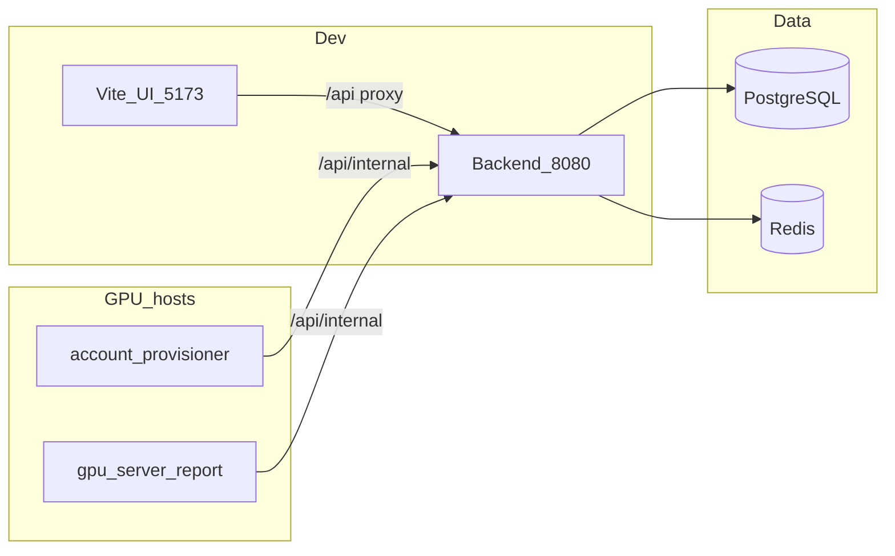

# GSAD — GPU Server Access Dashboard

GPU server access management: users apply for SSH access; agents on GPU hosts provision accounts and report metrics. Stack: Spring Boot 4 / Java 21, Vue 3 + Vite, PostgreSQL 16, Redis 7, Traefik v3.

## Prerequisites

- Docker and Docker Compose
- Node.js (frontend dev only)
- Clone with submodules:

```bash
git clone --recursive git@github.com:zeroDtree/server-manager.git
# or, after a plain clone:
git submodule update --init --recursive
```

## Quick start (dev)

```bash
cp dockers/.env.example .env
docker compose --profile mock up --build
cd gsad-frontend && npm install && npm run dev
```

`compose.override.yaml` merges [`dockers/compose.dev.yaml`](dockers/compose.dev.yaml) automatically — backend, Postgres, and Redis bind to the host. The `mock` profile starts 30 simulated GPU agents.

| URL | Purpose |
|-----|---------|
| http://localhost:5173 | Vue UI (Vite dev server) |
| http://localhost:8080/api/* | Backend API |
| http://localhost:8080/swagger-ui.html | Swagger UI (dev profile only) |
| http://localhost:8080/v3/api-docs | OpenAPI JSON (live) |

Vite proxies `/api` to `http://localhost:8080` ([`gsad-frontend/vite.config.ts`](gsad-frontend/vite.config.ts)).

**Dev seed data** (Flyway `dev` profile): admin `admin@gsad.local` / `Admin@123456`; 30 mock servers `gpu-mock-001` … `gpu-mock-030`. After migration changes: `docker compose down -v`, then re-up.

## Architecture



In production, traffic splits into two paths: users reach the UI and public `/api` over HTTPS via Traefik; GPU agents reach `/api/internal/*` over plain HTTP on `BACKEND_AGENT_PORT` (see [Agent access & security](#agent-access--security)).

## Repository layout

Git submodules — run `git submodule update --init --recursive` after clone.

| Path | Role |
|------|------|
| [gsad-backend](gsad-backend/) | REST API, Flyway, internal agent routes |
| [gsad-frontend](gsad-frontend/) | Vue UI |
| [server-agent](server-agent/) | account-provisioner + gpu-server-report (systemd on GPU hosts) |
| [dockers](dockers/) | Compose files and Dockerfiles |

## Production

**Central stack** (one host, Traefik on `gsad_traefik` network):

```bash
cp dockers/.env.example .env
# Set SPRING_PROFILES_ACTIVE=prod, GSAD_PUBLIC_HOST, ACME_EMAIL, strong secrets
# DNS for GSAD_PUBLIC_HOST must point at this host; open ports 80 and 443
docker compose -f compose.yaml -f dockers/compose.prod.yaml --profile prod up -d --build
```

Traefik terminates HTTPS (Let's Encrypt). Agent access uses a separate HTTP port — details below.

### Agent access & security

**Two entry paths**

| Path | Audience | Protocol | Routes |
|------|----------|----------|--------|
| Users / browser | HTTPS `:443` via Traefik | `/`, `/api/*` (JWT) |
| GPU agents | Direct host `BACKEND_AGENT_PORT` | HTTP | `/api/internal/*` (`X-Agent-PSK`) |

**Why HTTP, not the public HTTPS URL?**

- Traefik blocks `/api/internal/*` on `:443` (by design).
- Agents use the central host's private/VPN IP (e.g. NetBird), not `https://${GSAD_PUBLIC_HOST}`.
- Avoids per-host TLS cert management; auth is via shared `AGENT_PSK`.

**Network requirements (required in prod)**

- Restrict `BACKEND_AGENT_PORT` (default `:8080`) to GPU hosts only — NetBird mesh CIDR, private LAN, or firewall allowlist.
- Do not expose `:8080` to the public internet (HTTP carries `X-Agent-PSK` in cleartext).
- Use a long random `AGENT_PSK`; prod startup rejects the default value.

**Agent config:** `REPORT_API_URL=http://<central-netbird-or-private-ip>:8080` — see [server-agent/README.md](server-agent/README.md).

**Local prod-like stack** (HTTP only, no certificate):

```bash
# In .env: SPRING_PROFILES_ACTIVE=prod, GSAD_PUBLIC_HOST=localhost
docker compose -f compose.yaml -f dockers/compose.prod.yaml -f dockers/compose.prod-local.yaml --profile prod up -d --build
```

Open `http://localhost/` (UI) and `http://localhost/api/*` (public API).

**GPU hosts:** deploy [server-agent](server-agent/) on each machine — see [Agent access & security](#agent-access--security) and [server-agent/README.md](server-agent/README.md).

Prod Flyway is schema-only; servers register via the agent report API. DB backup: [`gsad-backend/deploy/scripts/backup-postgres.sh`](gsad-backend/deploy/scripts/backup-postgres.sh).

## Configuration

Copy `dockers/.env.example` to `.env` at the repo root.

| Variable | Description |
|----------|-------------|
| `SPRING_PROFILES_ACTIVE` | `dev` (default) or `prod` |
| `GSAD_PUBLIC_HOST` | Public hostname for Traefik (prod); use `localhost` for prod-local |
| `ACME_EMAIL` | Let's Encrypt email (prod HTTPS) |
| `BACKEND_AGENT_PORT` | Host port for GPU agent internal API (default `8080`) |
| `AGENT_PSK` | `X-Agent-PSK` for internal APIs |
| `JWT_SECRET` | JWT signing key (≥32 chars in prod) |
| `DB_PASSWORD` / `REDIS_PASSWORD` | Data store passwords |
| `CORS_ALLOWED_ORIGINS` | Optional prod CORS origins (comma-separated); empty when UI and API share the same host via Traefik |

## Tests

```bash
cd gsad-backend && ./mvnw test
cd gsad-frontend && npm test
```

## Further reading

- [gsad-backend/README.md](gsad-backend/README.md) — API routes, schema, Flyway
- [server-agent/README.md](server-agent/README.md) — GPU host agent install
- [gsad-frontend/openapi/openapi.json](gsad-frontend/openapi/openapi.json) — OpenAPI spec (checked in)
