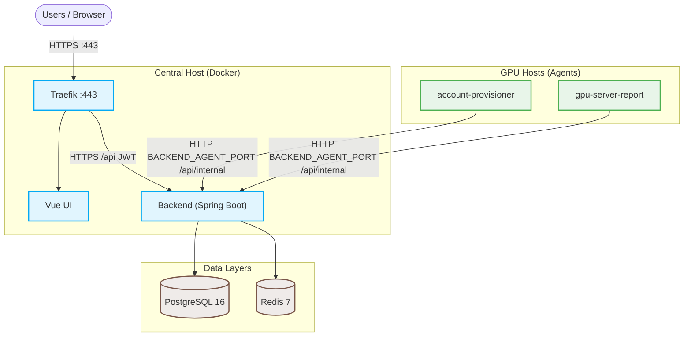

# GSAD — GPU Server Access Dashboard

[](https://www.oracle.com/java/)
[](https://spring.io/projects/spring-boot)
[](https://vuejs.org/)
[](https://vitejs.dev/)
[](https://www.postgresql.org/)
[](https://redis.io/)
[](https://traefik.io/)
[](https://www.docker.com/)

> Self-hosted dashboard for GPU SSH access: users apply, agents provision accounts, and reporters send metrics.

## Quick Links

| [🚀 Production Deploy](#deploy) | [💻 Local Tryout (No TLS)](docs/local-prod.md) | [🛠️ UI & Agent Dev](docs/dev.md) | [👥 Student Onboarding](account_prepare/README.md) |
| :---: | :---: | :---: | :---: |

---



> [!NOTE]
> Agents call `/api/internal/*` over HTTP on `BACKEND_AGENT_PORT` (private/VPN IP). Traefik blocks these routes on `:443`. See [Agent network and security](docs/agent-network.md).

## Prerequisites

- Docker and Docker Compose
- **Production HTTPS:** A server with a public IP reachable from the internet (this host, where you run the deploy steps below). Point DNS A/AAAA records for `GSAD_PUBLIC_HOST` at that address; allow inbound TCP **80** and **443** (Traefik terminates TLS and obtains Let's Encrypt certificates).

## Deploy

1. Clone with submodules:

```bash
git clone --recursive git@github.com:zeroDtree/server-manager.git
# or, after a plain clone:
# git submodule update --init --recursive
```

2. Configure `.env` and deploy (`deploy-prod.sh` runs preflight and `secret.sh` internally):

```bash
cp .env.example .env
```

```ini
# edit GSAD_PUBLIC_HOST and ACME_EMAIL in .env
GSAD_PUBLIC_HOST=gsad.example.com
ACME_EMAIL=admin@example.com
```

```bash
ADMIN_EMAIL=admin@example.com ./utils/deploy-prod.sh
```

If you skipped `ADMIN_EMAIL`, create the admin after deploy: `ADMIN_EMAIL=admin@example.com ./utils/create-prod-admin.sh`.

Local HTTP stack (no TLS): set `GSAD_PUBLIC_HOST=localhost` in `.env`, then `ADMIN_EMAIL=admin@example.com ./utils/deploy-prod.sh --local` (see [docs/local-prod.md](docs/local-prod.md)).

3. Log in with the admin from step 2.
4. **Admin → Import servers** (CSV); [derive agent PSKs](docs/agent-psk.md); deploy [server-agent](server-agent/) on each GPU host.
5. **Admin → Import users**.

> [!WARNING]
> Restrict `BACKEND_AGENT_PORT` (default `:8080`) to GPU hosts / VPN CIDR only — see [docs/agent-network.md](docs/agent-network.md). Enable [backups](docs/backup.md) and test restore periodically.

## Upgrade

```bash
git pull && git submodule update --init --recursive && \
  ./utils/deploy-prod.sh --no-admin
```

Upgrade agents on GPU hosts ([server-agent/README.md](server-agent/README.md)):

```bash
# On each GPU host, inside the server-agent clone:
git pull && git submodule update --init --recursive && sudo ./deploy/install.sh
```

## Configuration

Set `GSAD_PUBLIC_HOST` and `ACME_EMAIL` in `.env`. `deploy-prod.sh` runs [`secret.sh`](utils/secret.sh) to generate `.env.secrets`. See [`.env.example`](.env.example) and [`.env.secrets.example`](.env.secrets.example).

## Other setups

| Setup                            | Guide                                    |
| -------------------------------- | ---------------------------------------- |
| Development (Vite + mock agents) | [docs/dev.md](docs/dev.md)               |
| Local stack without TLS          | [docs/local-prod.md](docs/local-prod.md) |

## Further reading

- [docs/agent-network.md](docs/agent-network.md) — agent HTTP access and firewall rules
- [docs/agent-psk.md](docs/agent-psk.md) — per-GPU host PSK derivation
- [docs/backup.md](docs/backup.md) — backup, restore, and log rotation
- [account_prepare/README.md](account_prepare/README.md) — spreadsheet onboarding workflow
- [gsad-backend/README.md](gsad-backend/README.md) — API routes, schema, Flyway
- [server-agent/README.md](server-agent/README.md) — GPU host agent install

License: [LICENSE](LICENSE)
