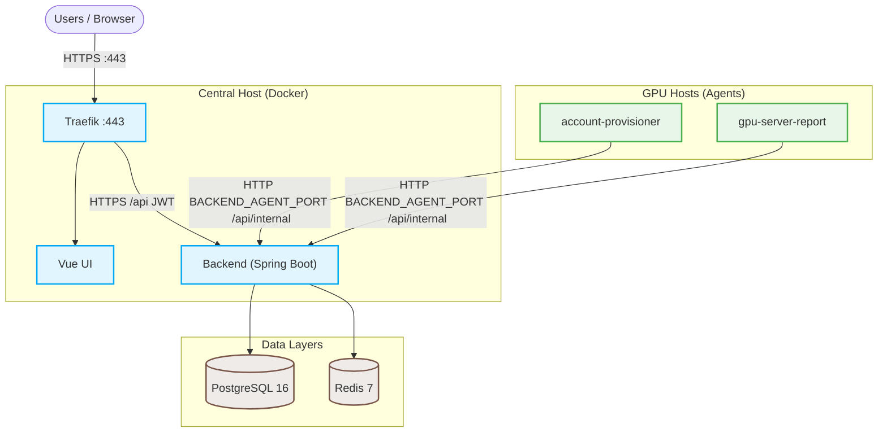

# GSAD — GPU Server Access Dashboard

<!-- Backend & Infrastructure -->
[](https://www.oracle.com/java/)
[](https://spring.io/projects/spring-boot)
[](https://www.postgresql.org/)
[](https://redis.io/)
[](https://traefik.io/)
<!-- Frontend & Agent -->
[](https://vuejs.org/)
[](https://vitejs.dev/)
[](https://www.docker.com/)

GSAD lets you manage SSH access to GPU servers through a web UI. Students or team members **apply for access**, backend agents **provision Linux accounts** on GPU hosts, and lightweight reporters **send GPU metrics** back to the dashboard. Everything runs in Docker on a single central host, with agents deployed on each GPU machine.

---


```mermaid
flowchart TB
  Browser(["Users / Browser"])

  subgraph central ["Central Host (Docker)"]
    Traefik["Traefik :443"]
    UI["Vue UI"]
    Backend["Backend (Spring Boot)"]
    Traefik --> UI
    Traefik -->|"HTTPS /api JWT"| Backend
  end

  subgraph data ["Data Layers"]
    PG[("PostgreSQL 16")]
    RD[("Redis 7")]
  end

  subgraph agents ["GPU Hosts (Agents)"]
    Prov["account-provisioner"]
    Rep["gpu-server-report"]
  end

  Browser -->|"HTTPS :443"| Traefik
  Backend --> PG
  Backend --> RD
  Prov -->|"HTTP BACKEND_AGENT_PORT  /api/internal"| Backend
  Rep -->|"HTTP BACKEND_AGENT_PORT  /api/internal"| Backend

  classDef central fill:#e1f5fe,stroke:#03a9f4,stroke-width:2px
  classDef data fill:#efebe9,stroke:#795548,stroke-width:2px
  classDef agents fill:#e8f5e9,stroke:#4caf50,stroke-width:2px
  class Traefik,UI,Backend central
  class PG,RD data
  class Prov,Rep agents
```

> [!NOTE]
> Agents call `/api/internal/*` over HTTP on `BACKEND_AGENT_PORT` (default `:8080`, private/VPN IP). Traefik blocks these routes on `:443`. See [Agent network and security](docs/agent-network.md).

> [!WARNING]
> Restrict `BACKEND_AGENT_PORT` (default `:8080`) to GPU hosts / VPN CIDR only — see [docs/agent-network.md](docs/agent-network.md). Exposing the agent port to the public internet is a security risk.

## Prerequisites

- Docker and Docker Compose
- **Production HTTPS:** A server with a public IP reachable from the internet (this host). Point DNS A/AAAA records for `GSAD_PUBLIC_HOST` at that address; allow inbound TCP **80** and **443** (Traefik terminates TLS and obtains Let's Encrypt certificates).

## Deploy

1. Clone with submodules:

  ```bash
  git clone --recursive git@github.com:zeroDtree/server-manager.git
  # or, after a plain clone:
  # git submodule update --init --recursive
  ```

2. Configure `.env` and deploy:

  ```bash
  cp .env.example .env
  # Edit GSAD_PUBLIC_HOST and ACME_EMAIL in .env, then deploy:
  ADMIN_EMAIL=admin@example.com ./utils/deploy-prod.sh
  ```

  > [!TIP]
  > **Common variations:**
  > - Forgot `ADMIN_EMAIL`? Create the admin after deploy: `ADMIN_EMAIL=admin@example.com ./utils/create-prod-admin.sh`
  > - **Existing edge Traefik** (e.g. NetBird on 80/443): set `TRAEFIK_EXTERNAL_NETWORK` in `.env`, then deploy with `--external` (see [docs/external-traefik.md](docs/external-traefik.md))

3. Log in with the admin from step 2.

4. **Admin → Import servers** (CSV); [derive agent PSKs](docs/agent-psk.md); deploy [server-agent](server-agent/) on each GPU host.

5. **Admin → Import users**.

## Post-deploy checklist

- [ ] **Secure the agent port:** Restrict `BACKEND_AGENT_PORT` (default `:8080`) to GPU hosts / VPN CIDR only. See [docs/agent-network.md](docs/agent-network.md).
- [ ] **(Optional) Student onboarding via spreadsheet:** Use [`account_prepare`](account_prepare/README.md) to convert registration XLSX data into GSAD + NetBird import CSVs, email unified credentials, and maintain a registration ledger (SQLite). Requires the GSAD stack running on this host.

## Upgrade

### Stack upgrade

```bash
git pull && git submodule update --init --recursive && \
  ./utils/deploy-prod.sh --no-admin
```

After the first deploy, stack mode is stored in `.gsad-compose-mode`; upgrades reuse it automatically (same as `./utils/gsad-compose.sh`). Use explicit flags to override or on a **fresh clone without that file**:

- **Bundled Traefik (default):** no flag, or `./utils/deploy-prod.sh --prod`
- **External edge Traefik:** `./utils/deploy-prod.sh --external` (required on first deploy; see [docs/external-traefik.md](docs/external-traefik.md))
- **Local HTTP:** `./utils/deploy-prod.sh --local`

### Agent upgrade on GPU hosts

On each GPU host, inside the `server-agent` clone:

```bash
git pull && git submodule update --init --recursive && sudo ./deploy/install.sh
```

See [server-agent/README.md](server-agent/README.md) for details.

## Stop

Stop the stack (containers only; data volumes kept):

```bash
./utils/gsad-compose.sh down
```

> [!NOTE]
> Stack mode is recorded in `.gsad-compose-mode` when you deploy. `./utils/gsad-compose.sh` and `./utils/deploy-prod.sh` read it automatically when no mode flag is passed; pass `--local` / `--external` / `--prod` to override.

To remove named volumes (including PostgreSQL data), add `-v`. See [docs/local-prod.md](docs/local-prod.md) for a local reset example.

## Configuration

### `.env` (manually edited)

| Key | Required | Default | Description |
|-----|----------|---------|-------------|
| `GSAD_PUBLIC_HOST` | **yes** | — | Public hostname for Traefik and DNS |
| `ACME_EMAIL` | **yes** (prod) | — | Let's Encrypt registration email |
| `SPRING_PROFILES_ACTIVE` | no | `dev` | Spring profile; set to `prod` for production |
| `BACKEND_AGENT_PORT` | no | `8080` | Host port for GPU agent API access |
| `BACKEND_AGENT_BIND` | **yes** (prod) | — | Bind address for agent port (e.g. `127.0.0.1` or VPN IP) |
| `BACKEND_AGENT_VPN_CIDRS` | no | — | Comma-separated overlay VPN CIDRs |
| `CORS_ALLOWED_ORIGINS` | no | — | Extra CORS origins (leave empty when UI and API share origin) |
| `TRAEFIK_EXTERNAL_NETWORK` | **yes** (`--external`) | — | Docker network for external edge Traefik |
| `TRAEFIK_ENTRYPOINT` | no | `websecure` | Traefik entrypoint name (external mode) |
| `TRAEFIK_CERT_RESOLVER` | no | `letsencrypt` | Traefik certificate resolver (external mode) |

### `.env.secrets` (auto-generated)

`deploy-prod.sh` runs [`secret.sh`](utils/secret.sh) to generate `.env.secrets` with random values for all secrets except `NETBIRD_TOKEN` and `SMTP_PASSWORD`, which must be set manually.

| Key | Source |
|-----|--------|
| `DB_PASSWORD`, `REDIS_PASSWORD`, `JWT_SECRET` | Auto-generated by `secret.sh` |
| `AGENT_MASTER_SECRET` | Auto-generated; used to [derive per-host PSKs](docs/agent-psk.md) |
| `CREDENTIALS_ENCRYPTION_KEY` | Auto-generated |
| `NETBIRD_TOKEN` | Set manually (for `account_prepare`) |
| `SMTP_PASSWORD` | Set manually (for `account_prepare`) |

See [`.env.example`](.env.example) and [`.env.secrets.example`](.env.secrets.example) for all keys.

## Further reading

- [docs/local-prod.md](docs/local-prod.md) — local tryout without TLS
- [docs/dev.md](docs/dev.md) — UI & agent development setup
- [docs/agent-network.md](docs/agent-network.md) — agent HTTP access and firewall rules
- [docs/external-traefik.md](docs/external-traefik.md) — reuse an existing edge Traefik (NetBird, etc.)
- [docs/agent-psk.md](docs/agent-psk.md) — per-GPU host PSK derivation
- [docs/backup.md](docs/backup.md) — backup, restore, and log rotation
- [account_prepare/README.md](account_prepare/README.md) — registration CSV onboarding workflow and field reference
- [gsad-backend/README.md](gsad-backend/README.md) — API routes, schema, Flyway
- [server-agent/README.md](server-agent/README.md) — GPU host agent install

License: [LICENSE](LICENSE)
