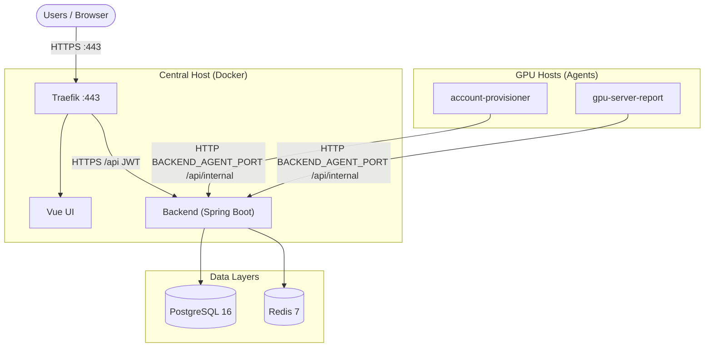

# GSAD — GPU Server Access Dashboard

GSAD lets you manage SSH access to GPU servers through a web UI. Team members **apply for access**, backend agents **provision Linux accounts** on GPU hosts, and lightweight reporters **send GPU metrics** back to the dashboard. Everything runs in Docker on a single central host, with agents deployed on each GPU machine.


```mermaid
flowchart TB
  Browser(["Users / Browser"])

  subgraph central ["Central Host (Docker)"]
    Traefik["Traefik :443"]
    UI["Vue UI"]
    Backend["Backend (Spring Boot)"]
    Traefik --> UI
    Traefik -->|"HTTPS /api JWT"| Backend
  end

  subgraph data ["Data Layers"]
    PG[("PostgreSQL 16")]
    RD[("Redis 7")]
  end

  subgraph agents ["GPU Hosts (Agents)"]
    Prov["account-provisioner"]
    Rep["gpu-server-report"]
  end

  Browser -->|"HTTPS :443"| Traefik
  Backend --> PG
  Backend --> RD
  Prov -->|"HTTP BACKEND_AGENT_PORT  /api/internal"| Backend
  Rep -->|"HTTP BACKEND_AGENT_PORT  /api/internal"| Backend
```

> [!WARNING]
> Restrict `BACKEND_AGENT_PORT` (default `:8080`) to GPU hosts / VPN CIDR only. Exposing the agent port to the public internet is a security risk. See [docs/agent-network.md](docs/agent-network.md).

## Prerequisites

- Docker and Docker Compose
- **Production HTTPS:** a public IP, DNS A/AAAA for `GSAD_PUBLIC_HOST`, inbound TCP **80** and **443** (Traefik terminates TLS via Let's Encrypt)

## Deploy

1. Clone with submodules:

  ```bash
  git clone --recursive git@github.com:zeroDtree/server-manager.git
  # or, after a plain clone: git submodule update --init --recursive
  ```

2. Copy [`.env.example`](.env.example) to `.env`. Edit `GSAD_PUBLIC_HOST`, `ACME_EMAIL`, and `BACKEND_AGENT_BIND`. Secrets are generated into `.env.secrets` by [`secret.sh`](utils/secret.sh) during deploy (see [`.env.secrets.example`](.env.secrets.example)):

  ```bash
  cp .env.example .env
  ADMIN_EMAIL=admin@example.com ./utils/deploy-prod.sh
  ```

   Variants: forgot `ADMIN_EMAIL` → `ADMIN_EMAIL=admin@example.com ./utils/create-prod-admin.sh`. Existing edge Traefik → `--external` ([docs/external-traefik.md](docs/external-traefik.md)). Local HTTP → `--local` ([docs/local-prod.md](docs/local-prod.md)). After the first deploy, upgrades reuse the recorded stack mode.

3. Log in with the admin from step 2.

4. **Admin → Import servers** (CSV); [derive agent PSKs](docs/agent-psk.md); deploy [server-agent](server-agent/) on each GPU host.

5. **Admin → Import users**, or bulk registration via [`account_prepare`](account_prepare/README.md).

## Upgrade and stop

```bash
git pull && git submodule update --init --recursive && \
  ./utils/deploy-prod.sh --no-admin
```

Upgrade agents on each GPU host — see [server-agent/README.md](server-agent/README.md).

Stop the stack (containers only; data volumes kept):

```bash
./utils/gsad-compose.sh down
```

## Docs

- [docs/local-prod.md](docs/local-prod.md) — local tryout without TLS
- [docs/dev.md](docs/dev.md) — UI & agent development setup
- [docs/agent-network.md](docs/agent-network.md) — agent HTTP access and firewall rules
- [docs/external-traefik.md](docs/external-traefik.md) — reuse an existing edge Traefik (NetBird, etc.)
- [docs/agent-psk.md](docs/agent-psk.md) — per-GPU host PSK derivation
- [docs/backup.md](docs/backup.md) — backup, restore, and log rotation
- [account_prepare/README.md](account_prepare/README.md) — student registration provisioning (WPS → CSV → NetBird/GSAD → email)
- [gsad-backend/README.md](gsad-backend/README.md) — API routes, schema, Flyway
- [server-agent/README.md](server-agent/README.md) — GPU host agent install

License: [LICENSE](LICENSE)
