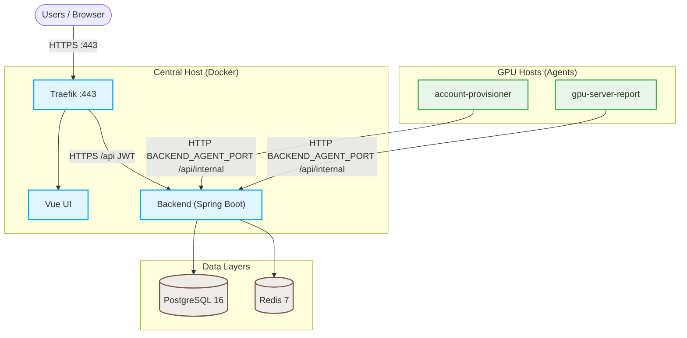

# GSAD — GPU 资源申请与分配

<p align="left">
  <a href="README.md">English</a> · <a href="README.zh-CN.md">简体中文</a>
</p>

[](https://www.oracle.com/java/)
[](https://spring.io/projects/spring-boot)
[](https://vuejs.org/)
[](https://vitejs.dev/)
[](https://www.postgresql.org/)
[](https://redis.io/)
[](https://traefik.io/)
[](https://www.docker.com/)

> 自托管 GPU SSH 访问面板：用户申请访问，agent 开通账号，reporter 上报指标。

## 快速通道

| [🚀 生产部署](#部署) | [💻 本地试用（无 TLS）](docs/local-prod.zh-CN.md) | [🛠️ UI 与 Agent 开发](docs/dev.zh-CN.md) | [👥 学生 Onboarding](#account-preparation表格--gsad--netbird) |
| :---: | :---: | :---: | :---: |

---

<details>
<summary><b>目录</b>（点击展开）</summary>

- [前置条件](#前置条件)
- [部署](#部署)
- [Agent access & security](#agent-access--security)
- [部署后](#部署后)
  - [First admin](#first-admin)
  - [Account preparation（表格 → GSAD + NetBird）](#account-preparation表格--gsad--netbird)
  - [Agent PSK (per GPU host)](#agent-psk-per-gpu-host)
  - [Backup and restore](#backup-and-restore)
  - [Upgrades and health](#upgrades-and-health)
- [仓库结构](#仓库结构)
- [配置](#配置)
- [其他环境](#其他环境)
- [测试](#测试)
- [延伸阅读](#延伸阅读)

</details>

---



> [!NOTE]
> Agent 通过私网/VPN IP 上的 `BACKEND_AGENT_PORT` 以 HTTP 调用 `/api/internal/*`。Traefik 在 `:443` 上拦截这些路由。详见 [Agent access & security](#agent-access--security)。

## 前置条件

- Docker 与 Docker Compose

## 部署

1. 带子模块克隆：

```bash
git clone --recursive git@github.com:zeroDtree/server-manager.git
# 或普通 clone 后：
# git submodule update --init --recursive
```

2. 配置 `.env` — 设置 `GSAD_PUBLIC_HOST` 与 `ACME_EMAIL`（生产 TLS）。运行 `./utils/secret.sh` 生成 `.env.secrets` 后部署：

```ini
# .env — 部署前编辑
GSAD_PUBLIC_HOST=gsad.example.com
ACME_EMAIL=admin@example.com
```

```bash
cp .env.example .env
# 在 .env 中设置 GSAD_PUBLIC_HOST 与 ACME_EMAIL
./utils/secret.sh
./utils/preflight.sh
./utils/deploy-prod.sh
```

可选：同次创建首个管理员：`ADMIN_EMAIL=admin@example.com ./utils/deploy-prod.sh`

本地无 TLS 预检：`./utils/preflight.sh --local && ./utils/deploy-prod.sh --local`（见 [docs/local-prod.zh-CN.md](docs/local-prod.zh-CN.md)）。

3. 将 `GSAD_PUBLIC_HOST` 的 DNS 指向本机；开放 80、443 端口。Traefik 终结 HTTPS（Let's Encrypt）。
4. `deploy-prod.sh` 会等待 backend 健康（容器 healthcheck）。手动检查：

```bash
docker compose -f compose.yaml -f dockers/compose.prod.yaml --profile prod exec -T backend \
  curl -sS http://localhost:8080/actuator/health
```

```json
{"status":"UP"}
```

5. 若跳过 admin 引导，见 [创建首个管理员](#first-admin)。
6. **Admin → Import servers**（CSV）；[派生 agent PSK](docs/agent-psk.zh-CN.md)；在各 GPU 主机部署 [server-agent](server-agent/)。
7. **Admin → Import users**。

> [!WARNING]
> **网络安全（步骤 8–9）**
> - 将 `BACKEND_AGENT_PORT`（默认 `:8080`）限制为 GPU 主机 / VPN 网段 — 切勿暴露到公网。
> - HTTP 明文传输 agent 凭据；启用 agent 前须验证边界防火墙。
> - 启用[备份](docs/backup.zh-CN.md)并定期测试恢复。

## Agent access & security

**两条入口**

| 路径            | 受众                 | 协议  | 路由                                                   |
| --------------- | -------------------- | ----- | ------------------------------------------------------ |
| 用户 / 浏览器   | HTTPS `:443` Traefik | HTTPS | `/`、`/api/*`（JWT）                                   |
| GPU agent       | `BACKEND_AGENT_PORT` | HTTP  | `/api/internal/*`（`X-Agent-Server-Id`、`X-Agent-PSK`） |

**为何用 HTTP 而非公网 HTTPS？**

- Traefik 在 `:443` 上按设计拦截 `/api/internal/*`。
- Agent 使用中心主机私网/VPN IP（如 NetBird），而非 `https://${GSAD_PUBLIC_HOST}`。
- 避免每台主机管理 TLS 证书；认证为基于 `AGENT_MASTER_SECRET` 派生的 per-server HMAC。

**网络要求**

- 将 `BACKEND_AGENT_PORT`（默认 `:8080`）限制为仅 GPU 主机 — NetBird mesh CIDR、私网 LAN 或防火墙白名单。
- `BACKEND_AGENT_BIND` 设为 `127.0.0.1` 或 RFC1918 地址；启动时拒绝 `0.0.0.0` 与公网 IP。

> [!WARNING]
> 勿将 `:8080` 暴露到公网。HTTP 明文传输 agent 凭据。

> [!IMPORTANT]
> 在**仅 backend** 使用足够长的随机 `AGENT_MASTER_SECRET`；backend 拒绝默认值。每台 GPU 主机派生 `AGENT_PSK` — 见 [Agent PSK (per GPU host)](docs/agent-psk.zh-CN.md)。切勿将 `AGENT_MASTER_SECRET` 部署到 GPU 主机。

**Agent 配置：** `REPORT_API_URL=http://<central-netbird-or-private-ip>:8080` — 见 [server-agent/README.md](server-agent/README.md)。

## 部署后

### First admin

Flyway 仅含 schema，**无预置管理员**。在 `backend` 与 `postgres` 健康后，用 [`create-prod-admin.sh`](utils/create-prod-admin.sh) 创建首个管理员。

在仓库根目录：

```bash
ADMIN_EMAIL=admin@example.com ./utils/create-prod-admin.sh
```

或内联设置密码（**不要**将 bootstrap 密码写入 `.env`）：

```bash
ADMIN_EMAIL=admin@example.com ADMIN_PASSWORD='your-strong-password' ./utils/create-prod-admin.sh
```

脚本**幂等**：若已有管理员则直接退出。dev/mock 后需干净 bootstrap 时，在[本地 HTTP 栈](docs/local-prod.zh-CN.md)执行 [`down -v`](docs/local-prod.zh-CN.md#reset-clean-db)，再 `up` 并重新运行本脚本。

可选环境变量：`ADMIN_LINUX_USERNAME`（默认 `gsadadmin`）、`ADMIN_DISPLAY_NAME`（默认 `Admin`）。

验证登录：

```bash
curl -sS -X POST "https://${GSAD_PUBLIC_HOST}/api/auth/login" \
  -H 'Content-Type: application/json' \
  -d '{"email":"admin@example.com","password":"<your-password>"}'
```

在[本地 HTTP 栈](docs/local-prod.zh-CN.md)上使用 `http://localhost/api/auth/login`。

通过侧栏 **Account → Change password**（或 `POST /api/auth/change-password`）修改 bootstrap 密码。

通过 **Admin → Import users** 导入用户。必填列：`email`、`linux_username`、`initial_password`（至少 8 位）。可选：`display_name`、`student_id`、`cohort`、`roles`。初始密码须通过安全渠道分发 — API 不会返回。管理员可在 **Admin → Users** 重置非管理员账号的登录密码。

### Account preparation（表格 → GSAD + NetBird）

[`account_prepare/`](account_prepare/) 负责表格批量 onboarding：SQLite 账本、`data/account_prepare/` 下导入 CSV、NetBird/GSAD 对账与统一凭据邮件。向学生收集哪些字段见 [docs/info.zh-CN.md](docs/info.zh-CN.md)；完整流程见 [account_prepare/README.md](account_prepare/README.md)（`prepare-accounts` → NetBird 导入 → GSAD UI 导入 → `reconcile-accounts` → `notify-accounts`）。

### Agent PSK (per GPU host)

每台 GPU agent 使用从仅 backend 持有的 `AGENT_MASTER_SECRET` 派生的 per-server HMAC。在可信机器上派生 `AGENT_PSK` 并部署到 agent — 见 [docs/agent-psk.zh-CN.md](docs/agent-psk.zh-CN.md)。

### Backup and restore

定时 Postgres 备份、日志轮转与恢复 — 见 [docs/backup.zh-CN.md](docs/backup.zh-CN.md)。

### Upgrades and health

- Backend 健康：`/actuator/health`
- Agent 健康：`:9091`（provisioner）、`:9092`（reporter）

```bash
curl -sS "https://${GSAD_PUBLIC_HOST}/actuator/health"
```

```json
{"status":"UP"}
```

升级中心栈：

```bash
git pull && git submodule update --init --recursive && \
  docker compose -f compose.yaml -f dockers/compose.prod.yaml --profile prod up -d --build
```

升级 GPU 主机 agent：`git pull && sudo ./deploy/install.sh`。

上线前预检：使用[本地 HTTP 栈](docs/local-prod.zh-CN.md)在真实 DNS 与 TLS 之前验证镜像与路由。

## 仓库结构

Git 子模块 — clone 后运行 `git submodule update --init --recursive`。

```text
server-manager/
├── gsad-backend/       # Spring Boot REST API
├── gsad-frontend/      # Vue 3 + Vite UI
├── server-agent/       # account-provisioner + gpu-server-report (systemd)
├── account_prepare/    # Spreadsheet onboarding (SQLite ledger)
├── netbird-manage/     # NetBird CLI (submodule)
├── dockers/            # Compose, Dockerfiles, mock agents
└── utils/              # 运维脚本（preflight、deploy-prod、密钥、admin、PSK、备份）
```

## 配置

部署需在 `.env` 中设置 `GSAD_PUBLIC_HOST` 与 `ACME_EMAIL`。运行 [`secret.sh`](utils/secret.sh) 生成 `.env.secrets`（$\ge 32$ 字符随机密钥）。已设置的键不会被覆盖。配置说明见 [`.env.example`](.env.example)；密钥键名见 [`.env.secrets.example`](.env.secrets.example)。

| 变量                             | 文件            | 必填?    | 默认           | 说明                                                                 |
| -------------------------------- | --------------- | -------- | -------------- | -------------------------------------------------------------------- |
| `GSAD_PUBLIC_HOST`               | `.env`          | **必填** | —              | Traefik 主机名与 DNS                                                 |
| `ACME_EMAIL`                     | `.env`          | **必填** | —              | Let's Encrypt TLS 证书注册邮箱                                       |
| `SPRING_PROFILES_ACTIVE`         | `.env`          | **必填** | `dev`          | 配合 `compose.prod.yaml` 时为 `prod`                                 |
| `CREDENTIALS_ENCRYPTION_KEY`     | `.env.secrets`  | **必填** | —              | SSH 凭据静态加密 AES 密钥（$\ge 32$ 字符）                            |
| `AGENT_MASTER_SECRET`            | `.env.secrets`  | **必填** | —              | 仅 backend；经 [docs/agent-psk.zh-CN.md](docs/agent-psk.zh-CN.md) 派生 PSK |
| `JWT_SECRET`                     | `.env.secrets`  | **必填** | —              | JWT 签名密钥（$\ge 32$ 字符）                                         |
| `DB_PASSWORD` / `REDIS_PASSWORD` | `.env.secrets`  | **必填** | —              | 数据存储密码                                                         |
| `BACKEND_AGENT_PORT`             | `.env`          | 可选     | `8080`         | Agent internal API 私网主机端口                                      |
| `BACKEND_AGENT_BIND`             | `.env`          | 可选     | `127.0.0.1`    | 仅 loopback 或 RFC1918 内网 IP                                       |
| `CORS_ALLOWED_ORIGINS`           | `.env`          | 可选     | 空             | UI 与 API 经 Traefik 同域时通常留空                                  |

> [!WARNING]
> 勿使用 `.env.secrets.example` 占位值。运行 [`secret.sh`](utils/secret.sh) 或手动设置强随机值。生产环境禁用 Swagger；agent 在私网 HTTP 端口使用派生 PSK + `X-Agent-Server-Id` 认证。

## 其他环境

| 环境                     | 文档                                         |
| ------------------------ | -------------------------------------------- |
| 开发（Vite + mock agent） | [docs/dev.zh-CN.md](docs/dev.zh-CN.md)       |
| 本地无 TLS 栈            | [docs/local-prod.zh-CN.md](docs/local-prod.zh-CN.md) |

## 测试

```bash
cd gsad-backend && ./mvnw test
cd gsad-frontend && npm run lint && npm run typecheck && npm test
```

许可证：[LICENSE](LICENSE)

## 延伸阅读

- [docs/agent-psk.zh-CN.md](docs/agent-psk.zh-CN.md) — 每台 GPU 主机 PSK 派生
- [docs/backup.zh-CN.md](docs/backup.zh-CN.md) — 备份、恢复与日志轮转
- [account_prepare/README.md](account_prepare/README.md) — 表格 onboarding 流程
- [gsad-backend/README.md](gsad-backend/README.md) — API 路由、schema、Flyway
- [server-agent/README.md](server-agent/README.md) — GPU 主机 agent 安装
- [gsad-frontend/openapi/openapi.json](gsad-frontend/openapi/openapi.json) — OpenAPI 规范（已入库）
