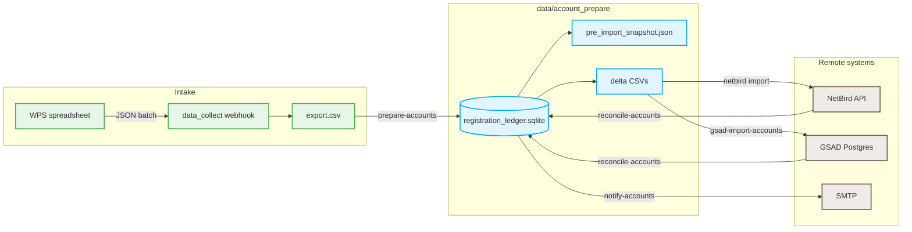
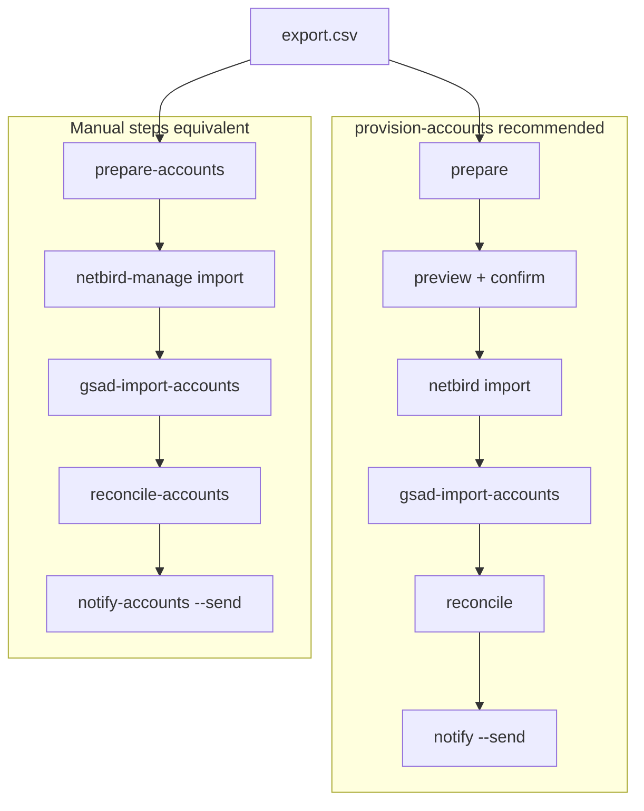

# Account prepare

Convert registration data into GSAD and NetBird import CSVs, then email unified credentials. A SQLite **registration ledger** is the source of truth for stable passwords and provisioning status.

> [!WARNING]
> Do not commit `data/account_prepare/`. It contains plaintext passwords and personal data. The directory is gitignored—do not force-add it.

---

## Overview

End-to-end flow from spreadsheet intake to credential email. The ledger holds generated passwords and tracks `gsad_status`, `netbird_status`, and `notified_at`.



---

## Quick start

Run from **repo root** on the GSAD server after new registrations arrive.

```bash
uv run --project account_prepare provision-accounts --input data_collect/data/export.csv
```

Preview pending deltas, confirm, then provision end-to-end (NetBird import, GSAD import, reconcile, notify).

| Flag | Effect |
| --- | --- |
| _(none)_ | Interactive confirm before remote changes |
| `--yes` | Skip confirmation |
| `--preview-only` | Prepare + preview; no remote writes |
| `--skip-notify` | Provision without email (then `notify-accounts --print` / `--send`) |

**Equivalent manual steps:**

```bash
uv run --project account_prepare prepare-accounts --input data_collect/data/export.csv
uv run --project netbird-manage user-manage import -f data/account_prepare/netbird_import_delta.csv --resolve-group-names
uv run --project account_prepare gsad-import-accounts -f data/account_prepare/gsad_users_delta.csv
uv run --project account_prepare reconcile-accounts
uv run --project account_prepare notify-accounts --send
```

---

## Prerequisites

- Run all commands from **repo root on the GSAD server** (where the stack and Postgres run). `prepare-accounts` and `reconcile-accounts` query GSAD Postgres via `./utils/gsad-compose.sh exec ...`; they fail if the stack is not up.
- **GSAD stack** running (mode recorded in `.gsad-compose-mode` after deploy)
- **Environment** — repo-root `.env` and `.env.secrets` configured (see [Configuration](#configuration))
- **NetBird** — group **`client_group`** must exist before import

One-time dependency sync:

```bash
cd account_prepare && uv sync
```

> [!TIP]
> For WPS automation, deploy [`data_collect`](../data_collect/README.md) on the same server and point its schema at [`examples/registration.yaml`](../data_collect/examples/registration.yaml).

---

## Registration data

Registrations arrive via WPS → [`data_collect`](../data_collect/README.md) → `data_collect/data/export.csv`. Pass that file to `prepare-accounts --input` (see [Workflow](#workflow)).

WPS sends JSON with keys `email`, `linux_username`, `name`, `student_id`, and `cohort` (see [`data_collect/examples/registration.yaml`](../data_collect/examples/registration.yaml)). CSV export headers must match [`registration_columns.yaml`](registration_columns.yaml).

| Header (CSV) | Field key | Description |
| --- | --- | --- |
| 邮箱 | `email` | GSAD and NetBird login; used for onboarding email |
| linux账户名 | `linux_username` | SSH username on GPU servers; lowercase, starts with a letter or `_`, only `a-z` `0-9` `_` `-`, max 32 chars, unique per person |
| 真实姓名 | `name` | Display name and email salutation |
| 学号 | `student_id` | Unique per person |
| 年级 | `cohort` | e.g. class of `2024`, `2025` |

> [!NOTE]
> Passwords are generated once on first ledger insert (separate GSAD and NetBird values). Re-running `prepare-accounts` preserves existing passwords. `linux_username` can be updated for an existing email; when it changes, only GSAD moves back to pending and must be re-imported. NetBird status is unchanged. `notified_at` is cleared so the user can be notified again after GSAD completes; existing password include flags are preserved, so unchanged passwords are not automatically re-emailed. **Do not collect** GSAD / NetBird passwords — they are generated by the system.

See [WPS automation](#wps-automation) for the spreadsheet upload script.

---

## WPS automation

Deploy [`data_collect`](../data_collect/README.md) and POST registration rows as JSON to its batch webhook. Replace the URL and bearer token with your deployment values. Field keys must match the table above.

| JSON key | CSV header |
| --- | --- |
| `email` | 邮箱 |
| `linux_username` | linux账户名 |
| `name` | 真实姓名 |
| `student_id` | 学号 |
| `cohort` | 年级 |

```py
import requests

df = dbt(field=["真实姓名", "邮箱", "linux账户名", "学号", "年级"])

records = df.to_dict(orient="records")

records = [
    {
        "email": record["邮箱"],
        "linux_username": record["linux账户名"],
        "name": record["真实姓名"],
        "student_id": record["学号"],
        "cohort": record["年级"],
    }
    for record in records
]

if not records:
    print("没有需要上传的数据")
    exit()

url = "https://collect.example.com/webhook/batch"

headers = {
    "Authorization": "Bearer xxx",
    "Content-Type": "application/json",
}

from prettytable import PrettyTable

try:
    resp = requests.post(url, headers=headers, json=records, timeout=10)
    print(f"状态码: {resp.status_code}\n")

    resp_data = resp.json()

    if "results" in resp_data:
        table = PrettyTable()
        table.field_names = ["姓名", "邮箱", "操作状态"]
        table.align["姓名"] = "l"
        table.align["邮箱"] = "l"
        table.align["操作状态"] = "c"

        for record, result in zip(records, resp_data["results"]):
            name = record["name"]
            email = record["email"]
            status = "新插入" if result.get("inserted") else ("已更新" if result.get("updated") else "无变化")
            table.add_row([name, email, status])

        print(table)
    else:
        print("返回格式不匹配：", resp.text)

except requests.exceptions.RequestException as e:
    print("请求失败：", e)
except ValueError:
    print("解析 JSON 失败：", resp.text)
```

---

## Workflow

Run steps **in order** after new registrations arrive. `provision-accounts` runs the full path below after confirmation.



When pending users exist, **prepare** writes `pre_import_snapshot.json` (remote emails before import). **Reconcile** compares against it to set `include_*_password` flags — emails that already existed in NetBird or GSAD before import do not receive that system's password in the notification.

- Re-running prepare is safe (ledger upserts by email).
- Existing GSAD emails are upserted (profile fields including `linux_username`; login password is not reset).
- Existing NetBird emails are skipped automatically on import.

1. **Prepare** — upsert ledger, export delta CSVs; capture pre-import snapshot when pending:

   ```bash
   uv run --project account_prepare prepare-accounts --input data_collect/data/export.csv
   ```

2. **NetBird import** — delta rows only:

   ```bash
   uv run --project netbird-manage user-manage import \
     -f data/account_prepare/netbird_import_delta.csv --resolve-group-names
   ```

3. **GSAD import** — admin API (also run by `provision-accounts`):

   ```bash
   uv run --project account_prepare gsad-import-accounts \
     -f data/account_prepare/gsad_users_delta.csv
   ```

4. **Reconcile** — sync ledger status from NetBird API and GSAD Postgres:

   ```bash
   uv run --project account_prepare reconcile-accounts
   ```

5. **Notify** — email users complete in both systems and not yet notified:

   ```bash
   uv run --project account_prepare notify-accounts --send
   ```

---

## Artifacts

All paths under `data/account_prepare/`:

| File | Type | Purpose |
| --- | --- | --- |
| `registration_ledger.sqlite` | SQLite | Source of truth (passwords, status, include_password flags, notified_at) |
| `pre_import_snapshot.json` | JSON | NetBird/GSAD emails captured before import (prepare, when pending) |
| `gsad_users.csv` | CSV | Full GSAD Admin user import |
| `gsad_users_delta.csv` | CSV | Rows with `gsad_status = pending` |
| `netbird_import.csv` | CSV | Full `user-manage import` |
| `netbird_import_delta.csv` | CSV | Rows with `netbird_status = pending` |
| `credentials.csv` | CSV | Full credential export |
| `credentials_delta.csv` | CSV | Same rows as GSAD delta (pending GSAD) |
| `gsad_registered_emails.csv` | CSV | GSAD email snapshot (reconcile) |
| `netbird_registered_emails.csv` | CSV | NetBird email snapshot (reconcile) |

---

## Configuration

Operator config in [`.env.example`](../.env.example) → `.env`; secrets in [`.env.secrets.example`](../.env.secrets.example) → `.env.secrets` (stack secrets via [`secret.sh`](../utils/secret.sh)). `account_prepare` commands load both from repo root automatically.

> [!NOTE]
> Put tokens and SMTP passwords in `.env.secrets`. Avoid `--token` or inline secrets on the command line — they can appear in shell history and process listings. (`reconcile-accounts` accepts `--token` from netbird-manage; `prepare-accounts` reads `NETBIRD_TOKEN` from env only.)
>
> **`netbird-manage` (workflow step 2):** run from **repo root** so it picks up repo-root `.env` and `.env.secrets`. Confirm the token is in `.env.secrets` (not `.env.secrets.example`) and non-empty:
>
> ```bash
> grep '^NETBIRD_TOKEN=' .env.secrets
> ```

| Variable | File | Required for | Notes |
| --- | --- | --- | --- |
| `NETBIRD_TOKEN` | `.env.secrets` | prepare (when pending), reconcile, provision | NetBird PAT |
| `NETBIRD_API_BASE` | `.env` | self-hosted NetBird | Full URL with scheme, e.g. `https://netbird.example.com` |
| `GSAD_PUBLIC_URL` | `.env` | notify, provision, gsad-import | Full GSAD login URL; API origin is derived from this host |
| `GSAD_ADMIN_EMAIL` | `.env.secrets` | provision, gsad-import | GSAD admin account for API import |
| `GSAD_ADMIN_PASSWORD` | `.env.secrets` | provision, gsad-import | GSAD admin password for API import |
| `NETBIRD_DASHBOARD_URL` | `.env` | notify (optional) | NetBird hint in email |
| `SMTP_HOST`, `SMTP_USER` | `.env` | notify `--send` | See [`.env.example`](../.env.example) |
| `SMTP_PASSWORD` | `.env.secrets` | notify `--send` | See [`.env.secrets.example`](../.env.secrets.example) |
| `SMTP_FROM` | `.env` | notify `--send` (optional) | Defaults to `SMTP_USER`; set only when the visible From address differs |
| `SMTP_PORT`, `SMTP_SSL`, `SMTP_USE_TLS`, `SMTP_DELAY_SECONDS` | `.env` | notify `--send` (optional) | See [`.env.example`](../.env.example) |

---

## Development

Run before commit or release:

```bash
cd account_prepare

uv run pytest
uv run ruff check && uv run ty check
```
