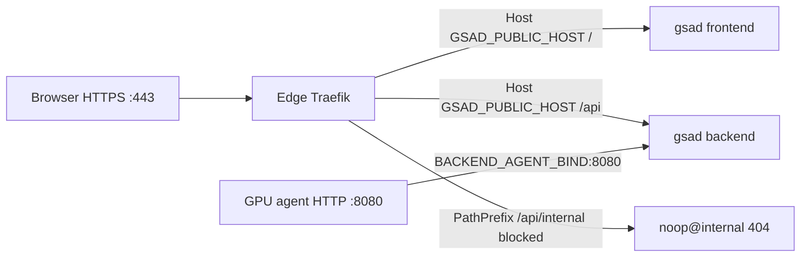

# External edge Traefik

## When to use

Use this mode when the host already runs an edge Traefik on **80/443** (e.g. NetBird `<edge-traefik-container>`). GSAD starts **postgres**, **redis**, **backend**, and **frontend** only; your Traefik routes HTTPS to them via Docker labels.

| Mode                            | Traefik                         | Typical use                                                              |
| ------------------------------- | ------------------------------- | ------------------------------------------------------------------------ |
| Default prod (`deploy-prod.sh`) | GSAD bundled Traefik on 80/443  | Dedicated host, Let's Encrypt via GSAD                                   |
| `--external`                    | Your existing edge Traefik      | NetBird or other edge proxy already on 80/443                            |
| `--local`                       | GSAD bundled Traefik on port 80 | Local HTTP testing — **conflicts** with an edge Traefik on the same host |

## Architecture



Agent traffic is unchanged: GPU hosts call `http://<central-host>:8080/api/internal/*` directly — never through Traefik. Configure `BACKEND_AGENT_BIND` and firewall rules in [Agent network and security](agent-network.md).

## Prerequisites

Your edge Traefik must:

- Use the **Docker provider** with `exposedByDefault=false`
- Share a Docker **network** with GSAD containers (same network as `--providers.docker.network`)
- Expose HTTPS on an entrypoint matching `TRAEFIK_ENTRYPOINT` (default `websecure`)
- Use a certificate resolver matching `TRAEFIK_CERT_RESOLVER` (default `letsencrypt`)

Before deploy:

- Copy [`.env.example`](../.env.example) to `.env` and set values below
- Point DNS for `GSAD_PUBLIC_HOST` at the host running edge Traefik
- Confirm `TRAEFIK_EXTERNAL_NETWORK` matches your edge Traefik's `--providers.docker.network` — `preflight.sh --external` does **not** verify the Docker network exists

## Configure `.env`

### Traefik (external mode)

```ini
GSAD_PUBLIC_HOST=gsad.example.com

TRAEFIK_EXTERNAL_NETWORK=netbird       # Docker network name
TRAEFIK_ENTRYPOINT=websecure             # match your Traefik entrypoint
TRAEFIK_CERT_RESOLVER=letsencrypt        # match your Traefik cert resolver
```

See [`.env.example`](../.env.example) for defaults. `ACME_EMAIL` may stay in `.env`; external mode does not use it — TLS is handled by your edge Traefik.

### Agent access (all prod modes)

Set `BACKEND_AGENT_BIND`, `BACKEND_AGENT_VPN_CIDRS`, and restrict `:8080` to GPU hosts — see [Agent network and security](agent-network.md).

### NetBird reference

Typical NetBird Traefik settings that work with GSAD defaults:

| NetBird Traefik                          | GSAD `.env`                         |
| ---------------------------------------- | ----------------------------------- |
| `--providers.docker.network=netbird`     | `TRAEFIK_EXTERNAL_NETWORK=netbird`  |
| `--entrypoints.websecure.address=:443`   | `TRAEFIK_ENTRYPOINT=websecure`      |
| `--certificatesresolvers.letsencrypt...` | `TRAEFIK_CERT_RESOLVER=letsencrypt` |

DNS ACME on the edge (via your DNS provider) is fine — GSAD only needs `Host()` router labels.

### Find the Docker network name

```bash
docker inspect <edge-traefik-container> --format '{{range $k, $v := .NetworkSettings.Networks}}{{$k}}{{"\n"}}{{end}}'
```

## Deploy

`deploy-prod.sh --external` runs preflight, [`secret.sh`](../utils/secret.sh) (creates `.env.secrets` if needed), compose up, backend health wait, and optional first admin.

```bash
ADMIN_EMAIL=admin@example.com ./utils/deploy-prod.sh --external
```

Run preflight alone to check config before deploy:

```bash
./utils/preflight.sh --external
```

If you skipped `ADMIN_EMAIL` on deploy:

```bash
ADMIN_EMAIL=admin@example.com ./utils/create-prod-admin.sh --external
```

## Verify

Check running containers — expect **postgres**, **redis**, **backend**, **frontend**; no GSAD **traefik** container:

```bash
./utils/gsad-compose.sh ps
```

Routing and security:

```bash
curl -Ik "https://${GSAD_PUBLIC_HOST}/"
curl -Ik "https://${GSAD_PUBLIC_HOST}/api/internal/servers/provision/pending"
```

Expected results:

| Request                                        | Expected           | Meaning                                                     |
| ---------------------------------------------- | ------------------ | ----------------------------------------------------------- |
| `https://${GSAD_PUBLIC_HOST}/`                 | **200** or **302** | UI reachable via edge Traefik                               |
| `https://${GSAD_PUBLIC_HOST}/api/internal/...` | **404**            | Blocked by `gsad-block` (`noop@internal`) — not the backend |

If the internal path returns **401** or **405**, traffic may be reaching the backend on HTTPS — check edge Traefik picked up the `gsad-block` labels and `TRAEFIK_ENTRYPOINT` / `TRAEFIK_CERT_RESOLVER` match your edge config.

## Upgrade

```bash
git pull && git submodule update --init --recursive && \
  ./utils/deploy-prod.sh --external --no-admin
```