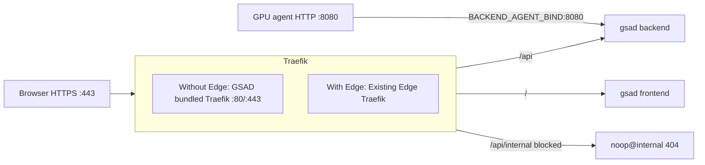

# External edge Traefik

## When to use

Use this mode when the host already runs an edge Traefik on **80/443**

## Architecture


```mermaid
flowchart LR
  Browser["Browser HTTPS :443"]
  Agent["GPU agent HTTP :8080"]

  subgraph traefik [Traefik]
    BundledTraefik["Without Edge: GSAD bundled Traefik :80/:443"]
    EdgeTraefik["With Edge: Existing Edge Traefik"]
  end

  Frontend["gsad frontend"]
  Backend["gsad backend"]
  Noop["noop@internal 404"]

  Browser --> traefik
  traefik -->|"/api"| Backend
  traefik -->|"/"| Frontend
  traefik -->|"/api/internal blocked"| Noop
  Agent -->|"BACKEND_AGENT_BIND:8080"| Backend
```


## Prerequisites

Your edge Traefik must:

- Use the **Docker provider** with `exposedByDefault=false`
- Share a Docker **network** with GSAD containers (same network as `--providers.docker.network`)
- Expose HTTPS on an entrypoint matching `TRAEFIK_ENTRYPOINT` (default `websecure`)
- Use a certificate resolver matching `TRAEFIK_CERT_RESOLVER` (default `letsencrypt`)

Example Traefik configuration:
```yaml
services:
  # Traefik reverse proxy (automatic TLS via Let's Encrypt)
  traefik:
    image: traefik:v3.6
    container_name: netbird-traefik
    restart: unless-stopped
    env_file:
      - ./traefik.env
    networks:
      netbird:
        ipv4_address: 172.30.0.10
    command:
      # Logging
      - "--log.level=INFO"
      - "--accesslog=true"
      # Docker provider
      - "--providers.docker=true"
      - "--providers.docker.exposedbydefault=false"
      - "--providers.docker.network=netbird"
      # Entrypoints
      - "--entrypoints.web.address=:80"
      - "--entrypoints.websecure.address=:443"
      - "--entrypoints.websecure.allowACMEByPass=true"
      # Disable timeouts for long-lived gRPC streams
      - "--entrypoints.websecure.transport.respondingTimeouts.readTimeout=0"
      - "--entrypoints.websecure.transport.respondingTimeouts.writeTimeout=0"
      - "--entrypoints.websecure.transport.respondingTimeouts.idleTimeout=0"
      # HTTP to HTTPS redirect
      - "--entrypoints.web.http.redirections.entrypoint.to=websecure"
      - "--entrypoints.web.http.redirections.entrypoint.scheme=https"
      # Let's Encrypt ACME
      - "--certificatesresolvers.letsencrypt.acme.email=your_acme_email@example.com"
      - "--certificatesresolvers.letsencrypt.acme.storage=/letsencrypt/acme.json"
      - "--certificatesresolvers.letsencrypt.acme.dnschallenge=true"
      - "--certificatesresolvers.letsencrypt.acme.dnschallenge.provider=tencentcloud"
      - "--certificatesresolvers.letsencrypt.acme.dnschallenge.resolvers=119.29.29.29:53"
      # gRPC transport settings
      - "--serverstransport.forwardingtimeouts.responseheadertimeout=0s"
      - "--serverstransport.forwardingtimeouts.idleconntimeout=0s"

    ports:
      - '443:443'
      - '80:80'
    volumes:
      - /var/run/docker.sock:/var/run/docker.sock:ro
      - netbird_traefik_letsencrypt:/letsencrypt

    logging:
      driver: "json-file"
      options:
        max-size: "500m"
        max-file: "2"
```


## Deploy with External Traefik

### Prepare `.env`

Copy [`.env.example`](../.env.example) to `.env` and set values below

```ini
GSAD_PUBLIC_HOST=gsad.example.com

TRAEFIK_EXTERNAL_NETWORK=netbird       # Docker network name
TRAEFIK_ENTRYPOINT=websecure             # match your Traefik entrypoint
TRAEFIK_CERT_RESOLVER=letsencrypt        # match your Traefik cert resolver
```

See [`.env.example`](../.env.example) for defaults. `ACME_EMAIL` may stay in `.env`; external mode does not use it — TLS is handled by your edge Traefik.

Point DNS for `GSAD_PUBLIC_HOST` at the host running edge Traefik

Confirm `TRAEFIK_EXTERNAL_NETWORK` matches your edge Traefik's `--providers.docker.network`

### Deploy

```bash
ADMIN_EMAIL=admin@example.com ./utils/deploy-prod.sh --external
```