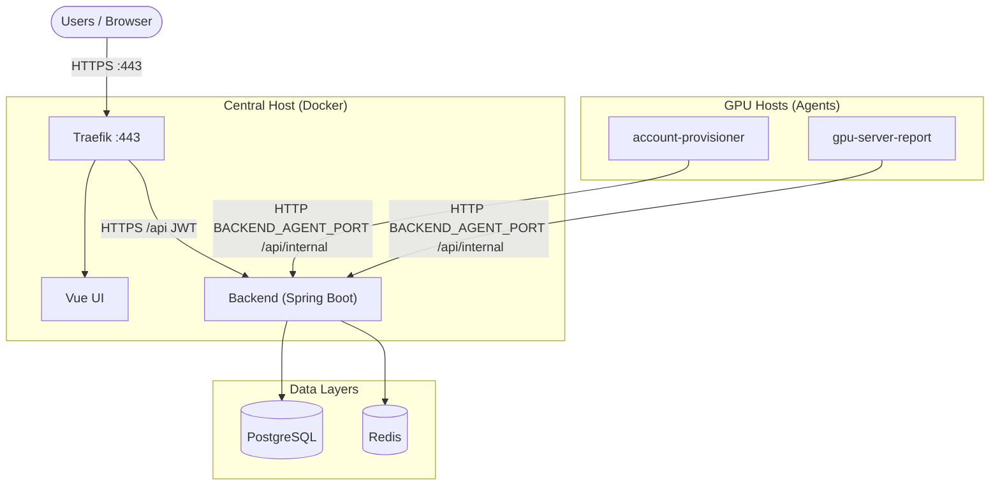

# GSAD — GPU Server Access Dashboard

GSAD lets you manage SSH access to GPU servers through a web UI. Team members **apply for access**, backend agents **provision Linux accounts** on GPU hosts, and lightweight reporters **send GPU metrics** back to the dashboard. Everything runs in Docker on a single central host, with agents deployed on each GPU machine.

## Start here

1. [Deploy](https://github.com/zeroDtree/server-manager#deploy) the central stack (clone, `.env`, `deploy-prod.sh`).
2. Add GPU hosts and copy the [agent PSK](./agent-psk.md).
3. Install [server-agent](https://github.com/zeroDtree/server-agent) on each GPU host.
4. Use the sidebar for operations, networking, backup, and local development.
