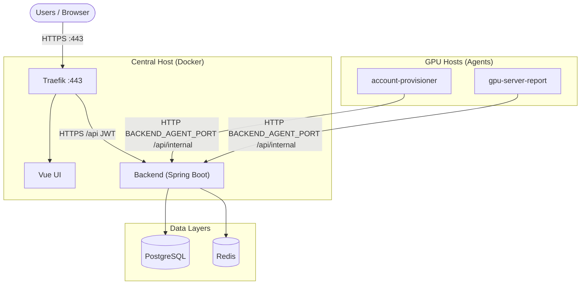

# GSAD — GPU Server Access Dashboard

This documentation is also available in [中文](./zh/).

GSAD lets you manage SSH access to GPU servers through a web UI. Team members **apply for access**, backend agents **provision Linux accounts** on GPU hosts, and lightweight reporters **send GPU metrics** back to the dashboard. Everything runs in Docker on a single central host, with agents deployed on each GPU machine.

Applying for access creates a Linux account on the target host. It does not reserve GPUs exclusively.

```mermaid
flowchart TB
  Browser(["Users / Browser"])

  subgraph central ["Central Host (Docker)"]
    Traefik["Traefik :443"]
    UI["Vue UI"]
    Backend["Backend (Spring Boot)"]
    Traefik --> UI
    Traefik -->|"HTTPS /api JWT"| Backend
  end

  subgraph data ["Data Layers"]
    PG[("PostgreSQL")]
    RD[("Redis")]
  end

  subgraph agents ["GPU Hosts (Agents)"]
    Prov["account-provisioner"]
    Rep["gpu-server-report"]
  end

  Browser -->|"HTTPS :443"| Traefik
  Backend --> PG
  Backend --> RD
  Prov -->|"HTTP BACKEND_AGENT_PORT  /api/internal"| Backend
  Rep -->|"HTTP BACKEND_AGENT_PORT  /api/internal"| Backend
```

## Using the console

The top-right **Language** control switches 中文 / English. **Change password** and **Sign out** are at the bottom of the sidebar.

| Sidebar | Who | Purpose |
| --- | --- | --- |
| [Resource board](./gsad-user-manual.md#gsad_board) | Everyone | Browse GPU load, then apply |
| [New application](./gsad-user-manual.md#gsad_apply) | Everyone | Request SSH access on a host |
| [My applications](./gsad-user-manual.md#gsad_apply) | Everyone | Copy connection details, cancel, or revoke |
| [User management](./gsad-admin-manual.md#gsad_admin_users) | Admin | Import, edit, disable, or delete accounts |
| [Server management](./gsad-admin-manual.md#gsad_admin_servers) | Admin | Register hosts and agent PSKs |
| [Settings](./gsad-admin-manual.md#gsad_admin_settings) | Admin | Login failure lockout |

## Get started

- **Production:** clone the repo, copy `.env.example` to `.env`, then `ADMIN_EMAIL=admin@example.com ./utils/deploy-prod.sh`. Full steps are in the [GitHub README](https://github.com/zeroDtree/server-manager#deploy).
- **Local prod-like HTTP:** [Local tryout without TLS](./local-prod.md)
- **Development (Vite + mock agents):** [Development](./dev.md)

## Manuals

- [User manual](./gsad-user-manual.md)
- [Admin manual](./gsad-admin-manual.md)
