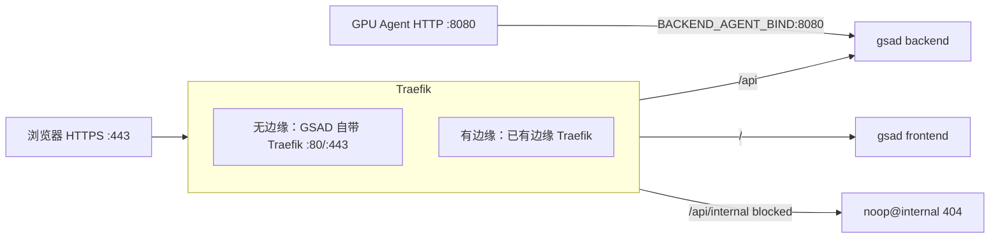

# 接入已有边缘 Traefik

## 适用场景

当主机上已经有占用 **80/443** 的边缘 Traefik 时，使用此模式。

## 架构



## 前置条件

边缘 Traefik 必须：

- 使用 **Docker provider**，且 `exposedByDefault=false`
- 与 GSAD 容器共享同一个 Docker **network**（与 `--providers.docker.network` 相同）
- 在与 `TRAEFIK_ENTRYPOINT` 匹配的入口上提供 HTTPS（默认 `websecure`）
- 使用与 `TRAEFIK_CERT_RESOLVER` 匹配的证书解析器（默认 `letsencrypt`）

示例 Traefik 配置：
```yaml
services:
  # Traefik reverse proxy (automatic TLS via Let's Encrypt)
  traefik:
    image: traefik:v3.6
    container_name: netbird-traefik
    restart: unless-stopped
    env_file:
      - ./traefik.env
    networks:
      netbird:
        ipv4_address: 172.30.0.10
    command:
      # Logging
      - "--log.level=INFO"
      - "--accesslog=true"
      # Docker provider
      - "--providers.docker=true"
      - "--providers.docker.exposedbydefault=false"
      - "--providers.docker.network=netbird"
      # Entrypoints
      - "--entrypoints.web.address=:80"
      - "--entrypoints.websecure.address=:443"
      - "--entrypoints.websecure.allowACMEByPass=true"
      # Disable timeouts for long-lived gRPC streams
      - "--entrypoints.websecure.transport.respondingTimeouts.readTimeout=0"
      - "--entrypoints.websecure.transport.respondingTimeouts.writeTimeout=0"
      - "--entrypoints.websecure.transport.respondingTimeouts.idleTimeout=0"
      # HTTP to HTTPS redirect
      - "--entrypoints.web.http.redirections.entrypoint.to=websecure"
      - "--entrypoints.web.http.redirections.entrypoint.scheme=https"
      # Let's Encrypt ACME
      - "--certificatesresolvers.letsencrypt.acme.email=your_acme_email@example.com"
      - "--certificatesresolvers.letsencrypt.acme.storage=/letsencrypt/acme.json"
      - "--certificatesresolvers.letsencrypt.acme.dnschallenge=true"
      - "--certificatesresolvers.letsencrypt.acme.dnschallenge.provider=tencentcloud"
      - "--certificatesresolvers.letsencrypt.acme.dnschallenge.resolvers=119.29.29.29:53"
      # gRPC transport settings
      - "--serverstransport.forwardingtimeouts.responseheadertimeout=0s"
      - "--serverstransport.forwardingtimeouts.idleconntimeout=0s"

    ports:
      - '443:443'
      - '80:80'
    volumes:
      - /var/run/docker.sock:/var/run/docker.sock:ro
      - netbird_traefik_letsencrypt:/letsencrypt

    logging:
      driver: "json-file"
      options:
        max-size: "500m"
        max-file: "2"
```

## 使用外部 Traefik 部署

### 准备 `.env`

将 [`.env.example`](../../.env.example) 复制为 `.env`，并设置下列值：

```ini
GSAD_PUBLIC_HOST=gsad.example.com

TRAEFIK_EXTERNAL_NETWORK=netbird       # Docker 网络名
TRAEFIK_ENTRYPOINT=websecure             # 与 Traefik 入口一致
TRAEFIK_CERT_RESOLVER=letsencrypt        # 与 Traefik 证书解析器一致
```

默认值见 [`.env.example`](../../.env.example)。`ACME_EMAIL` 可以留在 `.env` 中；外部模式不会用到它 —— TLS 由边缘 Traefik 处理。

把 `GSAD_PUBLIC_HOST` 的 DNS 指到运行边缘 Traefik 的主机。

确认 `TRAEFIK_EXTERNAL_NETWORK` 与边缘 Traefik 的 `--providers.docker.network` 一致。

### 部署

```bash
ADMIN_EMAIL=admin@example.com ./utils/deploy-prod.sh --external
```
