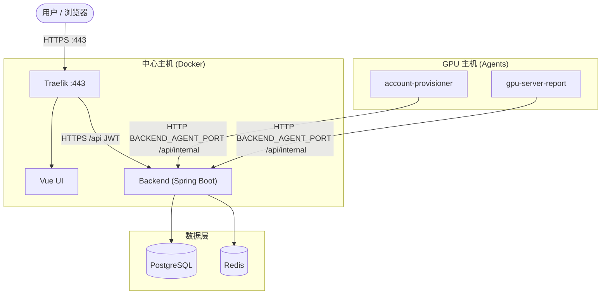

# GSAD — GPU 服务器访问控制台

本文档也提供 [English](../index.md) 版本。

GSAD 通过 Web 控制台管理 GPU 服务器的 SSH 访问。成员**申请访问**，后端 Agent 在 GPU 主机上**开通 Linux 账号**，轻量上报进程把 **GPU 指标**发回看板。中心主机用 Docker 运行整套服务，每台 GPU 机器部署 Agent。

申请访问会在目标主机创建 Linux 账号，**不会**独占预留 GPU。

## 使用控制台

右上角 **语言** 可在 中文 / English 之间切换。**修改密码** 和 **退出登录** 在侧栏底部。

| 侧栏 | 谁可用 | 用途 |
| --- | --- | --- |
| [资源看板](./gsad-user-manual.md#gsad_board) | 所有人 | 浏览 GPU 负载，再发起申请 |
| [新建申请](./gsad-user-manual.md#gsad_apply) | 所有人 | 申请某台主机的 SSH 访问 |
| [我的申请](./gsad-user-manual.md#gsad_apply) | 所有人 | 复制连接信息、取消或撤销 |
| [用户管理](./gsad-admin-manual.md#gsad_admin_users) | 管理员 | 导入、编辑、禁用或删除账号 |
| [服务器管理](./gsad-admin-manual.md#gsad_admin_servers) | 管理员 | 登记主机与 agent PSK |
| [系统设置](./gsad-admin-manual.md#gsad_admin_settings) | 管理员 | 登录失败锁定 |

## 开始使用

- **生产环境：** 克隆仓库，将 `.env.example` 复制为 `.env`，然后执行 `ADMIN_EMAIL=admin@example.com ./utils/deploy-prod.sh`。完整步骤见 [GitHub README](https://github.com/zeroDtree/server-manager#deploy)。
- **本地类生产 HTTP：** [本地无 TLS 试用](./local-prod.md)
- **开发环境（Vite + mock Agent）：** [开发环境](./dev.md)

## 手册

- [用户手册](./gsad-user-manual.md)
- [管理员手册](./gsad-admin-manual.md)
